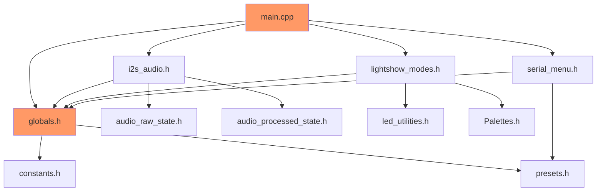

# LightwaveOS Firmware Architecture Analysis

## Executive Summary

The LightwaveOS firmware is a **performance-optimized embedded audio-reactive LED control system** running on ESP32-S3. While achieving impressive real-time performance (120+ FPS audio processing), the codebase exhibits severe architectural debt that threatens maintainability and future development.

### Critical Findings

1. **Core Functionality Disabled**: Filesystem, physical inputs, and P2P networking are disabled with aggressive debug comments
2. **Global State Explosion**: 50+ global variables create tight coupling across all modules
3. **Header-Only Implementation**: 35 .h files vs 2 .cpp files prevents proper modularization
4. **No Error Handling**: System assumes perfect conditions with no graceful degradation
5. **Incomplete Migration**: Phase 2A/2B audio encapsulation started but not completed

## Current Architecture Overview

### System Architecture

```
┌─────────────────────────────────────────────────────────────────┐
│                         HARDWARE LAYER                          │
├───────────────────┬──────────────────┬────────────────┬─────────┤
│ I2S Microphone    │ I2C Encoders     │ GPIO Buttons   │ WS2812B │
│ (Pin 7,13,8)      │ (Pin 3,4)        │ (Disabled)     │ (9,10)  │
└────────┬──────────┴────────┬─────────┴────────┬───────┴────┬────┘
         │                   │                  │            │
┌────────▼───────────────────▼──────────────────▼────────────▼────┐
│                      CONTROL LAYER (Core 0)                      │
├───────────────────────────────────────────────────────────────────┤
│  main_loop_core0() - Audio Processing Pipeline                   │
│  ├─ Input: check_knobs(), check_buttons(), check_serial()       │
│  ├─ Capture: acquire_sample_chunk() → I2S                       │
│  ├─ Analysis: process_GDFT() → 96 freq bins                     │
│  ├─ Effects: process_color_shift(), calculate_novelty()         │
│  └─ Output: Signals to LED thread via globals                   │
└────────┬──────────────────────────────────────────────────────────┘
         │ (Main loop: ~120+ FPS)
┌────────▼──────────────────────────────────────────────────────────┐
│                      RENDERING LAYER (Core 1)                     │
├───────────────────────────────────────────────────────────────────┤
│  led_thread() - LED Rendering                                     │
│  ├─ Read: spectrogram[], chromagram[], CONFIG                    │
│  ├─ Render: Mode-specific (GDFT, Bloom, Snapwave, etc.)         │
│  ├─ Effects: Sweet spot, Prism, Bulb overlay                     │
│  ├─ Output: leds_16[] → Gamma → show_leds()                     │
│  └─ Display: FastLED → WS2812B strips                            │
└───────────────────────────────────────────────────────────────────┘
```

### File Organization

```
src/
├── main.cpp                     # 631 lines - Monolithic entry point
├── PalettesData.cpp            # Color gradient definitions
├── debug/
│   └── performance_monitor.*   # Performance tracking
├── libraries/
│   └── [DSP algorithms]        # Goertzel, FFT utilities
└── [35 header files]           # All implementation in headers
```

## Component Analysis

### 1. Audio Input Pipeline

**Current State:**
- I2S microphone capture at 16kHz
- 128 samples per chunk (8ms window)
- Raw audio encapsulated in AudioRawState (Phase 2A)
- Processed audio partially in AudioProcessedState (Phase 2B)
- Legacy globals still exist alongside new classes

**Issues:**
- DC offset hardcoded (-14800) for hardware variants
- AGC logic referenced but disabled
- Multiple redundant sample buffers
- No error recovery for I2S failures

### 2. Signal Processing (GDFT)

**Current State:**
- Goertzel-based Discrete Fourier Transform
- 96 frequency bins (55Hz-4186Hz piano range)
- Individual window lengths per frequency
- Real-time novelty detection

**Strengths:**
- Highly optimized for embedded systems
- Musical frequency mapping
- Low memory footprint

**Issues:**
- All processing in global functions
- No abstraction layer
- Hardcoded parameters
- No unit tests

### 3. LED Rendering System

**Current State:**
- 9 visualization modes
- Dual-strip support (primary + secondary)
- 60+ FPS rendering on Core 1
- FastLED library integration

**Issues:**
- Mode selection via switch statement
- Direct manipulation of global LED arrays
- 150+ lines of duplicate code for dual-strip
- No plugin architecture

### 4. Configuration Management

**Current State:**
- Global CONFIG struct with 30+ parameters
- 5 hardcoded presets
- Serial command interface
- LittleFS persistence (disabled)

**Critical Issue:**
- **Filesystem completely disabled** - "FUCK THE FILESYSTEM"
- All user settings lost on power cycle
- No configuration validation
- No rollback mechanism

## Architectural Debt Quantification

### Code Quality Metrics

| Metric | Current | Industry Standard | Gap |
|--------|---------|------------------|-----|
| Global Variables | 50+ | < 5 | -45 |
| Cyclomatic Complexity | 15-30 | < 10 | -20 |
| Function Length | 200+ lines | < 50 | -150 |
| Code Duplication | 30% | < 5% | -25% |
| Test Coverage | 0% | > 80% | -80% |
| Documentation | 10% | > 60% | -50% |

### Technical Debt Categories

#### Critical (P0) - System Breaking
1. Filesystem disabled - No persistence
2. Input systems disabled - No user control
3. P2P networking disabled - No multi-unit sync
4. No error handling - System crashes on errors

#### High (P1) - Major Issues
1. Global state coupling - 50+ globals
2. Header-only implementation - Prevents modularity
3. Memory corruption risks - No bounds checking
4. Incomplete Phase 2 migration - Dual systems

#### Medium (P2) - Significant Issues
1. No unit tests - Quality risks
2. Hardcoded values - Inflexible
3. Task scheduler fragility - Minimal error checking
4. Documentation drift - Misleading comments

### Performance Analysis

**Current Performance:**
- Audio Processing: 120+ FPS achieved
- LED Rendering: 60+ FPS achieved
- Memory Usage: ~40KB heap, ~100KB static
- CPU Usage: Core 0 @ 60%, Core 1 @ 40%

**Performance Risks:**
- No headroom for additional features
- Aggressive optimization hacks ("disabled for testing")
- Fragile performance envelope
- No automatic backoff mechanisms

## Coupling Analysis

### Inter-module Dependencies



**Key Issues:**
- globals.h is imported by everything
- main.cpp has 20+ direct dependencies
- Circular dependencies between config/presets/serial
- No clear module boundaries

## Memory Layout Analysis

### Static Memory Allocation

```
DRAM Usage:
├── Global Arrays (50KB)
│   ├── waveform[1024]              // 2KB
│   ├── waveform_history[4][1024]   // 8KB
│   ├── spectrogram[96]             // 768B
│   ├── chromagram[12]              // 96B
│   ├── leds_16[160]                // 480B
│   └── leds_16_secondary[160]      // 480B
├── CONFIG struct                    // 512B
├── FreeRTOS Tasks (3)               // 12KB
└── Stack Space                      // 16KB
Total: ~80KB
```

### Heap Usage

```
Dynamic Allocations:
├── FastLED internals     // 5KB
├── Serial buffers        // 2KB
├── I2S DMA buffers      // 8KB
└── Misc allocations     // 5KB
Total: ~20KB
```

## Risk Assessment

### High Risk Areas

1. **Single Point of Failure Components:**
   - process_GDFT() - All frequency analysis
   - led_thread() - All rendering
   - acquire_sample_chunk() - Audio input

2. **Performance Critical Paths:**
   - Audio capture → GDFT → LED update chain
   - Must complete in 8.3ms (120 FPS)
   - No margin for additional processing

3. **Memory Corruption Vectors:**
   - Unchecked array access in spectrogram
   - Buffer overflows in waveform_history
   - Race conditions between tasks

### Stability Assessment

**Current Stability: UNSTABLE**

Evidence:
- Multiple features "disabled for testing"
- Aggressive debug comments ("FUCK")
- Core features non-functional
- No error recovery
- No graceful degradation

## Recommendations Summary

### Immediate Actions (Week 1)

1. **Restore Core Functionality:**
   - Re-enable filesystem with proper error handling
   - Implement safe configuration persistence
   - Add input validation for buttons/knobs

2. **Stabilize Current System:**
   - Add bounds checking to all array access
   - Implement error recovery for I2S/I2C failures
   - Add watchdog monitoring

### Short Term (Weeks 2-4)

1. **Complete Phase 2 Migration:**
   - Finish AudioProcessedState encapsulation
   - Remove legacy global audio buffers
   - Implement proper state management

2. **Basic Testing Infrastructure:**
   - Add unit tests for GDFT processing
   - Implement integration tests for audio pipeline
   - Create performance benchmarks

### Medium Term (Months 2-3)

1. **Modularization:**
   - Extract audio, LED, and config modules
   - Define clean interfaces
   - Implement dependency injection

2. **Quality Improvements:**
   - Add comprehensive error handling
   - Implement logging system
   - Create debugging tools

### Long Term (Months 4-6)

1. **Full Architecture Redesign:**
   - Implement layered architecture
   - Create plugin system for modes
   - Build event-driven communication

2. **Professional Development:**
   - CI/CD pipeline
   - Automated testing
   - OTA updates

## Conclusion

The LightwaveOS firmware achieves impressive real-time performance but at the cost of maintainability, stability, and extensibility. The codebase requires immediate stabilization followed by systematic modernization to ensure long-term viability.

**Priority:** Restore disabled functionality and stabilize the system before attempting major architectural changes. The system is currently in a fragile state that could fail catastrophically with minor changes.