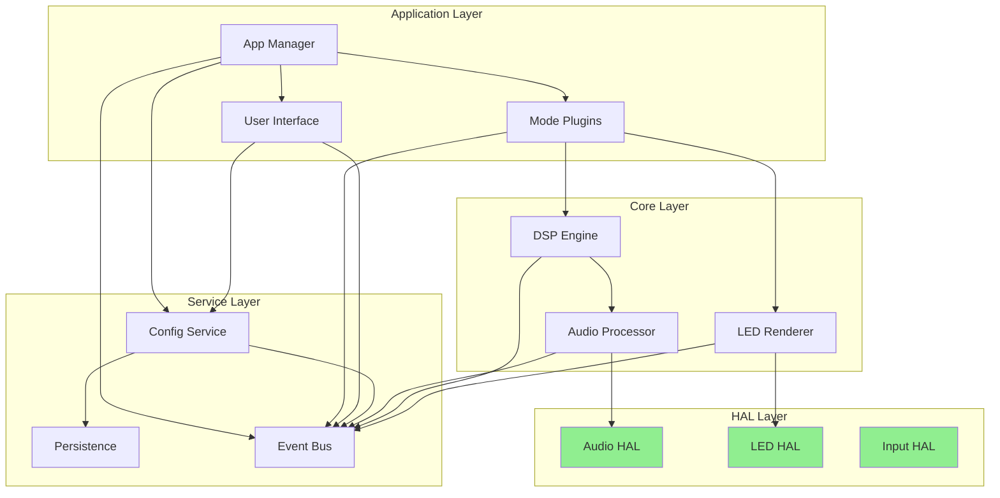

# LightwaveOS Module Design Specification

## Module Architecture Overview

This document defines the detailed design specifications for each module in the modernized LightwaveOS architecture. Each module is designed with clear boundaries, well-defined interfaces, and minimal dependencies.

## Core Design Principles

1. **Single Responsibility**: Each module has one clear purpose
2. **Interface Segregation**: Small, focused interfaces
3. **Dependency Inversion**: Depend on abstractions, not concretions
4. **Open/Closed**: Open for extension, closed for modification
5. **Liskov Substitution**: Implementations are interchangeable

## Module Hierarchy

```
LightwaveOS/
├── HAL/                 # Hardware Abstraction Layer
│   ├── Audio/          # I2S audio interface
│   ├── LED/            # WS2812B interface
│   ├── Input/          # Encoders, buttons
│   └── Storage/        # Flash/SPIFFS
├── Core/                # Core business logic
│   ├── Audio/          # Audio processing
│   ├── DSP/            # Signal processing
│   ├── Render/         # LED rendering
│   └── Scheduler/      # Task management
├── Services/            # Application services
│   ├── Config/         # Configuration management
│   ├── Persistence/    # Data persistence
│   ├── Communication/  # Serial, WiFi, BLE
│   └── Diagnostics/    # Logging, monitoring
└── Application/         # Application layer
    ├── Modes/          # Visualization modes
    ├── UI/             # User interface
    └── Manager/        # Application manager
```

## Detailed Module Specifications

### 1. HAL::Audio Module

**Purpose**: Abstract I2S audio hardware interface for platform independence

```cpp
namespace HAL::Audio {

// Configuration structure
struct AudioConfig {
    uint32_t sampleRate = 16000;      // Hz
    uint8_t bitsPerSample = 16;       // bits
    uint8_t channels = 1;              // mono/stereo
    uint32_t bufferSize = 128;        // samples

    // I2S pins
    struct Pins {
        uint8_t bclk = 7;
        uint8_t ws = 13;
        uint8_t din = 8;
    } pins;

    // Advanced settings
    bool applyDCOffset = true;
    int16_t dcOffsetValue = -14800;
    bool enableAGC = false;
};

// Audio sample buffer
class AudioBuffer {
private:
    std::array<int16_t, 1024> samples;
    size_t validSamples;
    uint32_t timestamp;

public:
    const int16_t* data() const { return samples.data(); }
    size_t size() const { return validSamples; }
    uint32_t time() const { return timestamp; }

    // Iterator support
    auto begin() const { return samples.begin(); }
    auto end() const { return samples.begin() + validSamples; }
};

// Main audio interface
class IAudioDriver {
public:
    virtual ~IAudioDriver() = default;

    // Initialization
    virtual Status initialize(const AudioConfig& config) = 0;
    virtual Status start() = 0;
    virtual Status stop() = 0;

    // Data acquisition
    virtual Result<AudioBuffer> capture(uint32_t timeoutMs = 100) = 0;
    virtual bool isDataAvailable() const = 0;

    // Configuration
    virtual Status reconfigure(const AudioConfig& config) = 0;
    virtual AudioConfig getConfig() const = 0;

    // Diagnostics
    virtual AudioStats getStatistics() const = 0;
    virtual Status runSelfTest() = 0;
};

// ESP32 I2S implementation
class ESP32I2SDriver : public IAudioDriver {
private:
    i2s_config_t i2sConfig;
    i2s_pin_config_t pinConfig;
    QueueHandle_t dataQueue;
    AudioConfig config;
    AudioStats stats;

    // DMA buffers
    static constexpr size_t DMA_BUFFER_COUNT = 4;
    static constexpr size_t DMA_BUFFER_SIZE = 512;

public:
    Status initialize(const AudioConfig& config) override;
    Result<AudioBuffer> capture(uint32_t timeoutMs) override;
    // ... other implementations
};

// Mock implementation for testing
class MockAudioDriver : public IAudioDriver {
private:
    std::function<AudioBuffer()> generator;

public:
    void setGenerator(std::function<AudioBuffer()> gen) {
        generator = gen;
    }

    Result<AudioBuffer> capture(uint32_t) override {
        if (generator) {
            return Result<AudioBuffer>::success(generator());
        }
        return Result<AudioBuffer>::error("No generator set");
    }
    // ... other implementations
};

} // namespace HAL::Audio
```

### 2. Core::DSP Module

**Purpose**: Digital signal processing algorithms and frequency analysis

```cpp
namespace Core::DSP {

// Frequency bin configuration
struct FrequencyBin {
    float centerFreq;     // Hz
    float bandwidth;      // Hz
    uint32_t windowSize;  // samples
    float gain;          // amplification factor
};

// DSP configuration
struct DSPConfig {
    std::vector<FrequencyBin> frequencyBins;

    // Goertzel parameters
    float minFrequency = 55.0f;    // A1 (lowest piano note)
    float maxFrequency = 4186.0f;  // C8 (highest piano note)
    uint8_t numBins = 96;

    // Processing options
    bool enableSmoothing = true;
    float smoothingFactor = 0.8f;
    bool enableNovelty = true;
    float noveltyThreshold = 0.3f;
};

// Frequency domain data
class FrequencyData {
private:
    std::array<float, 96> magnitudes;
    std::array<float, 96> phases;
    float totalEnergy;
    uint32_t timestamp;

public:
    float getMagnitude(size_t bin) const { return magnitudes[bin]; }
    float getPhase(size_t bin) const { return phases[bin]; }
    float getEnergy() const { return totalEnergy; }

    // Analysis functions
    size_t getPeakBin() const;
    float getPeakFrequency() const;
    std::array<float, 12> toChromagram() const;
};

// Main DSP processor interface
class IDSPProcessor {
public:
    virtual ~IDSPProcessor() = default;

    // Configuration
    virtual Status configure(const DSPConfig& config) = 0;

    // Processing
    virtual Result<FrequencyData> processFrame(const AudioBuffer& audio) = 0;
    virtual Result<float> calculateNovelty(const FrequencyData& current) = 0;

    // Advanced features
    virtual std::array<float, 12> extractChroma(const FrequencyData& freq) = 0;
    virtual std::vector<float> extractMFCC(const AudioBuffer& audio, uint8_t numCoeffs = 13) = 0;
};

// Goertzel-based DFT implementation
class GDFTProcessor : public IDSPProcessor {
private:
    DSPConfig config;

    // Goertzel state for each bin
    struct GoertzelState {
        float coeff;
        float s1, s2;
        uint32_t windowSize;
    };
    std::array<GoertzelState, 96> goertzelStates;

    // History for novelty detection
    std::array<FrequencyData, 4> history;
    size_t historyIndex = 0;

public:
    Status configure(const DSPConfig& config) override {
        this->config = config;
        initializeGoertzelCoefficients();
        return Status::OK;
    }

    Result<FrequencyData> processFrame(const AudioBuffer& audio) override;

private:
    void initializeGoertzelCoefficients();
    float computeGoertzelMagnitude(const int16_t* samples, size_t n, const GoertzelState& state);
};

// FFT-based processor (alternative implementation)
class FFTProcessor : public IDSPProcessor {
private:
    static constexpr size_t FFT_SIZE = 1024;
    std::array<float, FFT_SIZE> window;  // Hamming window
    std::array<std::complex<float>, FFT_SIZE/2 + 1> fftBuffer;

public:
    Result<FrequencyData> processFrame(const AudioBuffer& audio) override;
    // ... other implementations
};

// Utility functions
namespace Utils {
    // Window functions
    std::vector<float> hammingWindow(size_t size);
    std::vector<float> blackmanHarrisWindow(size_t size);

    // Frequency conversions
    float binToFrequency(size_t bin, float sampleRate, size_t fftSize);
    size_t frequencyToBin(float freq, float sampleRate, size_t fftSize);

    // Musical note detection
    std::string frequencyToNote(float freq);
    float noteToFrequency(const std::string& note);
}

} // namespace Core::DSP
```

### 3. Core::Render Module

**Purpose**: LED rendering pipeline and color management

```cpp
namespace Core::Render {

// Color representation
struct Color {
    uint8_t r, g, b;

    // Conversions
    static Color fromHSV(float h, float s, float v);
    static Color fromRGB(uint8_t r, uint8_t g, uint8_t b);

    // Operations
    Color blend(const Color& other, float factor) const;
    Color gammaCorrect(float gamma = 2.2f) const;
};

// LED strip configuration
struct StripConfig {
    uint16_t numLEDs = 160;
    uint8_t dataPin = 9;

    // Color correction
    Color colorCorrection = {255, 176, 240};  // Typical for WS2812B
    uint8_t maxBrightness = 255;

    // Physical layout
    enum Layout { LINEAR, MATRIX, RING, CUSTOM } layout = LINEAR;
    uint16_t width = 160;   // For matrix layout
    uint16_t height = 1;    // For matrix layout
};

// Render request data
struct RenderFrame {
    std::vector<Color> colors;
    uint8_t brightness = 255;

    // Effects
    bool applyGamma = true;
    bool applyDithering = false;
    float fadeSpeed = 1.0f;
};

// Main renderer interface
class ILEDRenderer {
public:
    virtual ~ILEDRenderer() = default;

    // Initialization
    virtual Status initialize(const StripConfig& config) = 0;

    // Rendering
    virtual Status render(const RenderFrame& frame) = 0;
    virtual Status show() = 0;  // Actually output to LEDs

    // Configuration
    virtual Status setBrightness(uint8_t brightness) = 0;
    virtual Status setColorCorrection(const Color& correction) = 0;

    // Effects
    virtual Status fadeToBlack(float rate) = 0;
    virtual Status crossfade(const RenderFrame& target, float progress) = 0;
};

// FastLED implementation
class FastLEDRenderer : public ILEDRenderer {
private:
    StripConfig config;
    std::vector<CRGB> ledBuffer;
    std::vector<CRGB> targetBuffer;  // For transitions

public:
    Status initialize(const StripConfig& config) override {
        this->config = config;
        ledBuffer.resize(config.numLEDs);

        // Initialize FastLED
        switch(config.dataPin) {
            case 9:
                FastLED.addLeds<WS2812B, 9, GRB>(ledBuffer.data(), config.numLEDs);
                break;
            // ... other pins
        }

        FastLED.setCorrection(CRGB(
            config.colorCorrection.r,
            config.colorCorrection.g,
            config.colorCorrection.b
        ));

        return Status::OK;
    }

    Status render(const RenderFrame& frame) override;
    // ... other implementations
};

// Render pipeline for complex effects
class RenderPipeline {
private:
    struct Stage {
        std::string name;
        std::function<RenderFrame(const RenderFrame&)> process;
    };
    std::vector<Stage> stages;

public:
    void addStage(const std::string& name,
                  std::function<RenderFrame(const RenderFrame&)> processor) {
        stages.push_back({name, processor});
    }

    RenderFrame process(const RenderFrame& input) {
        RenderFrame result = input;
        for (const auto& stage : stages) {
            result = stage.process(result);
        }
        return result;
    }
};

// Palette management
class Palette {
private:
    std::vector<Color> colors;
    std::string name;

public:
    Palette(const std::string& name, std::initializer_list<Color> colors)
        : name(name), colors(colors) {}

    Color getColor(float position) const;  // 0.0 to 1.0
    Color getColorCyclic(float position) const;  // Wraps around

    // Predefined palettes
    static const Palette RAINBOW;
    static const Palette SUNSET;
    static const Palette OCEAN;
    static const Palette FOREST;
};

} // namespace Core::Render
```

### 4. Services::Config Module

**Purpose**: Configuration management with validation and persistence

```cpp
namespace Services::Config {

// Configuration value with metadata
class ConfigValue {
private:
    std::variant<bool, int, float, std::string> value;
    std::string key;
    std::string description;

public:
    template<typename T>
    T get() const { return std::get<T>(value); }

    template<typename T>
    void set(const T& val) { value = val; }

    std::string toString() const;
    static ConfigValue fromString(const std::string& str);
};

// Configuration schema for validation
struct ConfigSchema {
    struct Field {
        std::string key;
        std::string type;  // "bool", "int", "float", "string"
        std::string description;

        // Validation rules
        std::optional<std::variant<bool, int, float, std::string>> defaultValue;
        std::optional<std::pair<float, float>> range;  // For numeric types
        std::optional<std::vector<std::string>> allowedValues;  // Enum
        std::optional<std::regex> pattern;  // For strings
    };

    std::vector<Field> fields;

    Result<void> validate(const ConfigValue& value) const;
};

// Main configuration container
class Configuration {
private:
    std::map<std::string, ConfigValue> values;
    ConfigSchema schema;
    std::vector<std::function<void(const std::string&, const ConfigValue&)>> observers;

public:
    // Value access
    template<typename T>
    T get(const std::string& key) const {
        auto it = values.find(key);
        if (it != values.end()) {
            return it->second.get<T>();
        }
        throw std::runtime_error("Config key not found: " + key);
    }

    template<typename T>
    Result<void> set(const std::string& key, const T& value) {
        ConfigValue cv;
        cv.set(value);

        // Validate against schema
        auto validation = schema.validate(cv);
        if (!validation.isOk()) {
            return validation;
        }

        // Store and notify
        auto oldValue = values[key];
        values[key] = cv;
        notifyObservers(key, cv);

        return Result<void>::success();
    }

    // Observers
    void subscribe(std::function<void(const std::string&, const ConfigValue&)> observer) {
        observers.push_back(observer);
    }

private:
    void notifyObservers(const std::string& key, const ConfigValue& value);
};

// Configuration service
class ConfigService {
private:
    Configuration current;
    Configuration defaults;
    std::unique_ptr<IPersistence> persistence;

    // Preset management
    std::map<std::string, Configuration> presets;

public:
    ConfigService(std::unique_ptr<IPersistence> persist)
        : persistence(std::move(persist)) {
        loadDefaults();
        loadPresets();
    }

    // Configuration operations
    Result<void> load();
    Result<void> save();
    Result<void> reset();

    // Preset operations
    Result<void> applyPreset(const std::string& name);
    std::vector<std::string> getPresetNames() const;

    // Value access (delegated)
    template<typename T>
    T get(const std::string& key) const {
        return current.get<T>(key);
    }

    template<typename T>
    Result<void> set(const std::string& key, const T& value) {
        auto result = current.set(key, value);
        if (result.isOk()) {
            // Auto-save if configured
            if (get<bool>("config.autosave")) {
                save();
            }
        }
        return result;
    }

    // Import/Export
    std::string exportJSON() const;
    Result<void> importJSON(const std::string& json);

private:
    void loadDefaults();
    void loadPresets();
};

// Default configuration values
namespace Defaults {
    const Configuration& getSystemDefaults();
    const Configuration& getAudioDefaults();
    const Configuration& getRenderDefaults();
    const Configuration& getPreset(const std::string& name);
}

} // namespace Services::Config
```

### 5. Application::Modes Module

**Purpose**: Visualization mode plugin system

```cpp
namespace Application::Modes {

// Audio features for mode processing
struct AudioFeatures {
    Core::DSP::FrequencyData spectrum;
    std::array<float, 12> chromagram;
    float novelty;
    float energy;
    float centroid;

    // Time-domain features
    float rms;
    float zcr;  // Zero crossing rate
    float peak;
};

// Mode configuration
struct ModeConfig {
    std::map<std::string, float> parameters;

    float getParam(const std::string& key, float defaultValue = 0.0f) const {
        auto it = parameters.find(key);
        return (it != parameters.end()) ? it->second : defaultValue;
    }
};

// Base class for all visualization modes
class VisualizationMode {
protected:
    std::string name;
    std::string description;
    ModeConfig config;
    Core::Render::StripConfig stripConfig;

public:
    VisualizationMode(const std::string& name, const std::string& desc)
        : name(name), description(desc) {}

    virtual ~VisualizationMode() = default;

    // Required interface
    virtual Core::Render::RenderFrame process(const AudioFeatures& features) = 0;
    virtual void configure(const ModeConfig& config) { this->config = config; }

    // Optional interface
    virtual void onEnter() {}  // Called when mode becomes active
    virtual void onExit() {}   // Called when mode becomes inactive
    virtual bool requiresHistory() const { return false; }  // Needs past frames

    // Metadata
    std::string getName() const { return name; }
    std::string getDescription() const { return description; }
    virtual std::vector<std::string> getParameterNames() const { return {}; }
};

// Example mode implementations

class SpectrumMode : public VisualizationMode {
private:
    Core::Render::Palette palette;
    std::array<float, 160> smoothedSpectrum;

public:
    SpectrumMode() : VisualizationMode("Spectrum", "Direct frequency visualization") {
        palette = Core::Render::Palette::RAINBOW;
    }

    Core::Render::RenderFrame process(const AudioFeatures& features) override {
        Core::Render::RenderFrame frame;
        frame.colors.resize(stripConfig.numLEDs);

        // Map frequency bins to LEDs
        for (size_t i = 0; i < stripConfig.numLEDs; ++i) {
            size_t bin = (i * features.spectrum.size()) / stripConfig.numLEDs;
            float magnitude = features.spectrum.getMagnitude(bin);

            // Apply smoothing
            smoothedSpectrum[i] = smoothedSpectrum[i] * 0.8f + magnitude * 0.2f;

            // Map to color
            float hue = config.getParam("hueOffset", 0.0f) + (float)i / stripConfig.numLEDs;
            float saturation = config.getParam("saturation", 1.0f);
            float value = smoothedSpectrum[i] * config.getParam("gain", 1.0f);

            frame.colors[i] = Core::Render::Color::fromHSV(hue, saturation, value);
        }

        return frame;
    }

    std::vector<std::string> getParameterNames() const override {
        return {"hueOffset", "saturation", "gain"};
    }
};

class ChromagramMode : public VisualizationMode {
public:
    ChromagramMode() : VisualizationMode("Chromagram", "12-note musical visualization") {}

    Core::Render::RenderFrame process(const AudioFeatures& features) override;
};

class BloomMode : public VisualizationMode {
private:
    std::vector<float> impulseResponse;
    size_t impulseIndex = 0;

public:
    BloomMode() : VisualizationMode("Bloom", "Reactive bloom effect") {}

    Core::Render::RenderFrame process(const AudioFeatures& features) override;
    bool requiresHistory() const override { return true; }
};

// Mode factory and registry
class ModeRegistry {
private:
    std::map<std::string, std::function<std::unique_ptr<VisualizationMode>()>> factories;

public:
    // Registration
    template<typename ModeType>
    void registerMode() {
        auto name = ModeType().getName();
        factories[name] = []() { return std::make_unique<ModeType>(); };
    }

    // Creation
    std::unique_ptr<VisualizationMode> create(const std::string& name) {
        auto it = factories.find(name);
        if (it != factories.end()) {
            return it->second();
        }
        return nullptr;
    }

    // Query
    std::vector<std::string> getAvailableModes() const {
        std::vector<std::string> names;
        for (const auto& [name, _] : factories) {
            names.push_back(name);
        }
        return names;
    }
};

// Mode manager
class ModeManager {
private:
    ModeRegistry registry;
    std::unique_ptr<VisualizationMode> currentMode;
    std::unique_ptr<VisualizationMode> nextMode;

    // Transition state
    enum class TransitionState { IDLE, FADING_OUT, FADING_IN };
    TransitionState transitionState = TransitionState::IDLE;
    float transitionProgress = 0.0f;
    float transitionSpeed = 0.05f;

public:
    ModeManager() {
        // Register built-in modes
        registry.registerMode<SpectrumMode>();
        registry.registerMode<ChromagramMode>();
        registry.registerMode<BloomMode>();
    }

    // Mode switching
    Result<void> switchTo(const std::string& modeName) {
        auto mode = registry.create(modeName);
        if (!mode) {
            return Result<void>::error("Unknown mode: " + modeName);
        }

        if (currentMode) {
            // Start transition
            nextMode = std::move(mode);
            transitionState = TransitionState::FADING_OUT;
            transitionProgress = 0.0f;
        } else {
            // Direct switch
            currentMode = std::move(mode);
            currentMode->onEnter();
        }

        return Result<void>::success();
    }

    // Processing
    Core::Render::RenderFrame process(const AudioFeatures& features) {
        if (!currentMode) {
            return Core::Render::RenderFrame{};
        }

        auto frame = currentMode->process(features);

        // Handle transitions
        if (transitionState != TransitionState::IDLE) {
            frame = processTransition(frame, features);
        }

        return frame;
    }

private:
    Core::Render::RenderFrame processTransition(
        const Core::Render::RenderFrame& current,
        const AudioFeatures& features
    );
};

} // namespace Application::Modes
```

## Inter-Module Communication

### Event System

```cpp
namespace Core::Events {

// Base event class
class Event {
protected:
    uint32_t timestamp;
    std::string source;

public:
    Event(const std::string& src)
        : timestamp(HAL::getMillis()), source(src) {}

    virtual ~Event() = default;
    virtual std::string getType() const = 0;
};

// Specific event types
class AudioFrameEvent : public Event {
private:
    AudioFeatures features;

public:
    AudioFrameEvent(const AudioFeatures& feat)
        : Event("AudioProcessor"), features(feat) {}

    std::string getType() const override { return "AudioFrame"; }
    const AudioFeatures& getFeatures() const { return features; }
};

class ConfigChangedEvent : public Event {
private:
    std::string key;
    ConfigValue oldValue;
    ConfigValue newValue;

public:
    ConfigChangedEvent(const std::string& k, const ConfigValue& old, const ConfigValue& newVal)
        : Event("ConfigService"), key(k), oldValue(old), newValue(newVal) {}

    std::string getType() const override { return "ConfigChanged"; }
};

// Event bus
class EventBus {
private:
    using Handler = std::function<void(const Event&)>;
    std::map<std::string, std::vector<Handler>> handlers;
    std::mutex handlerMutex;

public:
    // Subscribe to events
    void subscribe(const std::string& eventType, Handler handler) {
        std::lock_guard<std::mutex> lock(handlerMutex);
        handlers[eventType].push_back(handler);
    }

    // Publish events
    void publish(const Event& event) {
        std::lock_guard<std::mutex> lock(handlerMutex);

        auto it = handlers.find(event.getType());
        if (it != handlers.end()) {
            for (const auto& handler : it->second) {
                handler(event);
            }
        }
    }

    // Async publishing
    void publishAsync(std::unique_ptr<Event> event) {
        // Queue for later processing
        eventQueue.push(std::move(event));
    }

private:
    std::queue<std::unique_ptr<Event>> eventQueue;
};

} // namespace Core::Events
```

## Module Dependency Graph



## Module Testing Strategy

Each module includes:

1. **Unit Tests**: Test module in isolation with mocks
2. **Integration Tests**: Test module interactions
3. **Performance Tests**: Verify real-time constraints
4. **Fuzzing Tests**: Test with random/malformed inputs

Example test structure:

```cpp
// test/Core/DSP/GDFTProcessor_test.cpp
TEST_SUITE("GDFTProcessor") {
    TEST_CASE("Processes sine wave correctly") {
        // Arrange
        GDFTProcessor processor;
        MockAudioBuffer audio = generateSineWave(440.0f, 16000, 1024);

        // Act
        auto result = processor.processFrame(audio);

        // Assert
        CHECK(result.isOk());
        CHECK(result.getValue().getPeakFrequency() == doctest::Approx(440.0f));
    }

    TEST_CASE("Handles empty buffer gracefully") {
        // Test error handling
    }

    TEST_CASE("Performance benchmark") {
        // Test real-time constraints
    }
}
```

## Module Build Configuration

Each module has its own CMakeLists.txt:

```cmake
# Core/DSP/CMakeLists.txt
add_library(core_dsp STATIC
    src/GDFTProcessor.cpp
    src/FFTProcessor.cpp
    src/Utils.cpp
)

target_include_directories(core_dsp PUBLIC
    ${CMAKE_CURRENT_SOURCE_DIR}/include
)

target_link_libraries(core_dsp PRIVATE
    hal_audio
    core_math
)

# Testing
if(BUILD_TESTS)
    add_executable(core_dsp_tests
        test/GDFTProcessor_test.cpp
        test/Utils_test.cpp
    )

    target_link_libraries(core_dsp_tests
        core_dsp
        doctest
    )
endif()
```

## Module Documentation

Each module includes:

1. **README.md**: Overview and usage examples
2. **API.md**: Detailed API documentation
3. **DESIGN.md**: Design decisions and rationale
4. **CHANGELOG.md**: Version history

This modular design provides clear separation of concerns, testability, and maintainability while preserving the real-time performance requirements of the LightwaveOS system.