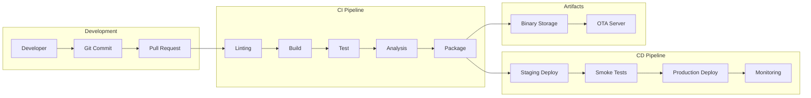

# LightwaveOS CI/CD Pipeline Design

## Overview

This document defines a modern CI/CD pipeline for the LightwaveOS ESP32-S3 firmware, enabling automated building, testing, and deployment with quality gates and monitoring throughout the development lifecycle.

## Pipeline Architecture



## GitHub Actions Workflows

### 1. Main CI Workflow

```yaml
# .github/workflows/ci.yml
name: Continuous Integration

on:
  push:
    branches: [main, develop, 'feature/**']
  pull_request:
    branches: [main, develop]

env:
  PLATFORMIO_VERSION: '6.1.11'
  ESP_IDF_VERSION: '5.1.1'

jobs:
  # Job 1: Code Quality Checks
  lint:
    name: Code Quality
    runs-on: ubuntu-latest
    steps:
      - name: Checkout Code
        uses: actions/checkout@v4

      - name: Setup Python
        uses: actions/setup-python@v4
        with:
          python-version: '3.11'

      - name: Cache Dependencies
        uses: actions/cache@v3
        with:
          path: ~/.cache/pip
          key: ${{ runner.os }}-pip-${{ hashFiles('requirements.txt') }}

      - name: Install Tools
        run: |
          pip install cpplint cppcheck clang-format

      - name: Run clang-format
        run: |
          find src -name "*.cpp" -o -name "*.h" | xargs clang-format -i --dry-run --Werror

      - name: Run cpplint
        run: |
          cpplint --recursive --exclude=lib --exclude=.pio src/

      - name: Run cppcheck
        run: |
          cppcheck --enable=all --suppress=missingIncludeSystem \
                   --error-exitcode=1 --inline-suppr \
                   --project=compile_commands.json

      - name: Check File Headers
        run: |
          python scripts/check_headers.py

  # Job 2: Build Firmware
  build:
    name: Build Firmware
    runs-on: ubuntu-latest
    needs: lint
    strategy:
      matrix:
        environment: [debug, release, benchmark]
        board: [esp32-s3-devkitc-1, esp32-s3-m5stack]

    steps:
      - name: Checkout Code
        uses: actions/checkout@v4
        with:
          submodules: recursive

      - name: Setup Python
        uses: actions/setup-python@v4
        with:
          python-version: '3.11'

      - name: Cache PlatformIO
        uses: actions/cache@v3
        with:
          path: |
            ~/.platformio
            .pio
          key: ${{ runner.os }}-pio-${{ matrix.board }}-${{ hashFiles('platformio.ini') }}

      - name: Install PlatformIO
        run: |
          pip install platformio==${{ env.PLATFORMIO_VERSION }}
          pio pkg install --global --platform espressif32

      - name: Generate Version Info
        run: |
          echo "BUILD_VERSION=$(git describe --tags --always --dirty)" >> $GITHUB_ENV
          echo "BUILD_TIME=$(date -u +"%Y-%m-%d %H:%M:%S")" >> $GITHUB_ENV
          echo "BUILD_COMMIT=$(git rev-parse HEAD)" >> $GITHUB_ENV

      - name: Build Firmware
        run: |
          pio run -e ${{ matrix.board }}_${{ matrix.environment }} \
                  -D VERSION_STRING="${{ env.BUILD_VERSION }}" \
                  -D BUILD_TIME="${{ env.BUILD_TIME }}" \
                  -D BUILD_COMMIT="${{ env.BUILD_COMMIT }}"

      - name: Generate Memory Report
        run: |
          pio run -e ${{ matrix.board }}_${{ matrix.environment }} --target size > memory_report.txt
          python scripts/analyze_memory.py memory_report.txt

      - name: Upload Firmware Artifacts
        uses: actions/upload-artifact@v3
        with:
          name: firmware-${{ matrix.board }}-${{ matrix.environment }}
          path: |
            .pio/build/${{ matrix.board }}_${{ matrix.environment }}/firmware.bin
            .pio/build/${{ matrix.board }}_${{ matrix.environment }}/firmware.elf
            .pio/build/${{ matrix.board }}_${{ matrix.environment }}/partitions.bin
            memory_report.txt

      - name: Check Binary Size
        run: |
          SIZE=$(stat -c%s .pio/build/${{ matrix.board }}_${{ matrix.environment }}/firmware.bin)
          if [ $SIZE -gt 1048576 ]; then
            echo "Binary size exceeds 1MB limit: $SIZE bytes"
            exit 1
          fi

  # Job 3: Run Tests
  test:
    name: Run Tests
    runs-on: ubuntu-latest
    needs: build
    strategy:
      matrix:
        test-type: [unit, integration, performance]

    steps:
      - name: Checkout Code
        uses: actions/checkout@v4

      - name: Setup Test Environment
        run: |
          pip install platformio==${{ env.PLATFORMIO_VERSION }}
          pip install pytest pytest-cov pytest-benchmark

      - name: Run ${{ matrix.test-type }} Tests
        run: |
          pio test --filter "${{ matrix.test-type }}/*" \
                   --junit-output-path=test-results-${{ matrix.test-type }}.xml \
                   --coverage

      - name: Generate Coverage Report
        if: matrix.test-type == 'unit'
        run: |
          lcov --capture --directory .pio/build \
               --output-file coverage.info
          lcov --remove coverage.info '/usr/*' '*/test/*' \
               --output-file coverage.info
          genhtml coverage.info --output-directory coverage-html

      - name: Upload Test Results
        if: always()
        uses: actions/upload-artifact@v3
        with:
          name: test-results-${{ matrix.test-type }}
          path: |
            test-results-${{ matrix.test-type }}.xml
            coverage.info
            coverage-html/

      - name: Upload Coverage to Codecov
        if: matrix.test-type == 'unit'
        uses: codecov/codecov-action@v3
        with:
          files: ./coverage.info
          flags: unittests
          name: codecov-umbrella

  # Job 4: Security and Quality Analysis
  analysis:
    name: Security & Quality Analysis
    runs-on: ubuntu-latest
    needs: test

    steps:
      - name: Checkout Code
        uses: actions/checkout@v4

      - name: Run Security Scan
        uses: aquasecurity/trivy-action@master
        with:
          scan-type: 'fs'
          scan-ref: '.'
          format: 'sarif'
          output: 'trivy-results.sarif'

      - name: Upload Security Results
        uses: github/codeql-action/upload-sarif@v2
        with:
          sarif_file: 'trivy-results.sarif'

      - name: SonarCloud Scan
        uses: SonarSource/sonarcloud-github-action@master
        env:
          GITHUB_TOKEN: ${{ secrets.GITHUB_TOKEN }}
          SONAR_TOKEN: ${{ secrets.SONAR_TOKEN }}

      - name: License Check
        run: |
          pip install licensecheck
          licensecheck --using requirements.txt

      - name: Dependency Check
        run: |
          pip install safety
          safety check --json --output dependency-report.json

      - name: Upload Analysis Reports
        uses: actions/upload-artifact@v3
        with:
          name: analysis-reports
          path: |
            trivy-results.sarif
            dependency-report.json
```

### 2. Deployment Workflow

```yaml
# .github/workflows/deploy.yml
name: Deployment Pipeline

on:
  push:
    tags:
      - 'v*'
  workflow_dispatch:
    inputs:
      environment:
        description: 'Deployment Environment'
        required: true
        default: 'staging'
        type: choice
        options:
          - staging
          - production

jobs:
  # Job 1: Prepare Release
  prepare:
    name: Prepare Release
    runs-on: ubuntu-latest
    outputs:
      version: ${{ steps.version.outputs.version }}
      changelog: ${{ steps.changelog.outputs.changelog }}

    steps:
      - name: Checkout Code
        uses: actions/checkout@v4
        with:
          fetch-depth: 0

      - name: Extract Version
        id: version
        run: |
          if [[ "${{ github.event_name }}" == "push" ]]; then
            VERSION=${GITHUB_REF#refs/tags/}
          else
            VERSION=$(git describe --tags --always)
          fi
          echo "version=$VERSION" >> $GITHUB_OUTPUT

      - name: Generate Changelog
        id: changelog
        run: |
          python scripts/generate_changelog.py > CHANGELOG.md
          echo "changelog<<EOF" >> $GITHUB_OUTPUT
          cat CHANGELOG.md >> $GITHUB_OUTPUT
          echo "EOF" >> $GITHUB_OUTPUT

  # Job 2: Build Release Binaries
  build-release:
    name: Build Release Binaries
    runs-on: ubuntu-latest
    needs: prepare
    strategy:
      matrix:
        board: [esp32-s3-devkitc-1, esp32-s3-m5stack]

    steps:
      - name: Checkout Code
        uses: actions/checkout@v4

      - name: Setup Build Environment
        run: |
          pip install platformio
          pio pkg install --global --platform espressif32

      - name: Build Release Firmware
        run: |
          pio run -e ${{ matrix.board }}_release \
                  -D VERSION_STRING="${{ needs.prepare.outputs.version }}"

      - name: Generate OTA Package
        run: |
          python scripts/create_ota_package.py \
                 --firmware .pio/build/${{ matrix.board }}_release/firmware.bin \
                 --version "${{ needs.prepare.outputs.version }}" \
                 --board ${{ matrix.board }} \
                 --output ${{ matrix.board }}-${{ needs.prepare.outputs.version }}.ota

      - name: Sign Binary
        run: |
          openssl dgst -sha256 -sign private_key.pem \
                  -out firmware.sig \
                  .pio/build/${{ matrix.board }}_release/firmware.bin

      - name: Upload Release Artifacts
        uses: actions/upload-artifact@v3
        with:
          name: release-${{ matrix.board }}
          path: |
            *.ota
            firmware.sig
            .pio/build/${{ matrix.board }}_release/firmware.bin

  # Job 3: Deploy to Environment
  deploy:
    name: Deploy to ${{ inputs.environment || 'staging' }}
    runs-on: ubuntu-latest
    needs: [prepare, build-release]
    environment: ${{ inputs.environment || 'staging' }}

    steps:
      - name: Download Artifacts
        uses: actions/download-artifact@v3
        with:
          path: artifacts/

      - name: Setup AWS CLI
        uses: aws-actions/configure-aws-credentials@v2
        with:
          aws-access-key-id: ${{ secrets.AWS_ACCESS_KEY_ID }}
          aws-secret-access-key: ${{ secrets.AWS_SECRET_ACCESS_KEY }}
          aws-region: us-west-2

      - name: Upload to S3
        run: |
          ENVIRONMENT="${{ inputs.environment || 'staging' }}"
          VERSION="${{ needs.prepare.outputs.version }}"

          aws s3 cp artifacts/ \
                  s3://lightwave-firmware/$ENVIRONMENT/$VERSION/ \
                  --recursive

      - name: Update OTA Server
        run: |
          curl -X POST https://ota.lightwave.io/api/firmware \
               -H "Authorization: Bearer ${{ secrets.OTA_API_TOKEN }}" \
               -d '{
                 "version": "${{ needs.prepare.outputs.version }}",
                 "environment": "${{ inputs.environment || 'staging' }}",
                 "changelog": "${{ needs.prepare.outputs.changelog }}",
                 "url": "https://s3.amazonaws.com/lightwave-firmware/..."
               }'

      - name: Deploy to Test Devices
        if: inputs.environment == 'staging'
        run: |
          python scripts/deploy_to_devices.py \
                 --group staging \
                 --version "${{ needs.prepare.outputs.version }}"

      - name: Run Smoke Tests
        run: |
          python scripts/smoke_tests.py \
                 --environment "${{ inputs.environment || 'staging' }}" \
                 --version "${{ needs.prepare.outputs.version }}"

  # Job 4: Create GitHub Release
  release:
    name: Create Release
    runs-on: ubuntu-latest
    needs: [prepare, deploy]
    if: github.event_name == 'push' && startsWith(github.ref, 'refs/tags/')

    steps:
      - name: Download Artifacts
        uses: actions/download-artifact@v3
        with:
          path: artifacts/

      - name: Create Release
        uses: softprops/action-gh-release@v1
        with:
          name: Release ${{ needs.prepare.outputs.version }}
          body: ${{ needs.prepare.outputs.changelog }}
          files: |
            artifacts/**/*.bin
            artifacts/**/*.ota
            artifacts/**/*.sig
          draft: false
          prerelease: ${{ contains(needs.prepare.outputs.version, 'rc') }}
```

### 3. Hardware Testing Workflow

```yaml
# .github/workflows/hardware-test.yml
name: Hardware-in-the-Loop Testing

on:
  schedule:
    - cron: '0 2 * * *'  # Daily at 2 AM
  workflow_dispatch:

jobs:
  hardware-test:
    name: HIL Testing
    runs-on: self-hosted  # Requires self-hosted runner with hardware
    timeout-minutes: 60

    steps:
      - name: Checkout Code
        uses: actions/checkout@v4

      - name: Setup Test Environment
        run: |
          python scripts/setup_hil_environment.py

      - name: Flash Firmware to DUT
        run: |
          esptool.py --chip esp32s3 \
                     --port /dev/ttyUSB0 \
                     --baud 921600 \
                     write_flash 0x0 test_firmware.bin

      - name: Run Hardware Tests
        run: |
          pytest tests/hardware/ \
                 --hardware-config=config/hil_setup.yaml \
                 --junit-xml=hil-results.xml

      - name: Capture Oscilloscope Data
        run: |
          python scripts/capture_scope_data.py \
                 --duration 10 \
                 --output scope_capture.csv

      - name: Analyze Power Consumption
        run: |
          python scripts/analyze_power.py \
                 --input power_log.csv \
                 --generate-report

      - name: Upload Test Results
        uses: actions/upload-artifact@v3
        with:
          name: hil-test-results
          path: |
            hil-results.xml
            scope_capture.csv
            power_report.html
```

## Docker Environments

### Build Environment

```dockerfile
# docker/Dockerfile.build
FROM ubuntu:22.04

# Install base dependencies
RUN apt-get update && apt-get install -y \
    python3 python3-pip \
    git curl wget \
    build-essential \
    cmake ninja-build \
    && rm -rf /var/lib/apt/lists/*

# Install PlatformIO
RUN pip3 install platformio==6.1.11

# Install ESP-IDF
ENV IDF_PATH=/opt/esp-idf
RUN git clone -b v5.1.1 --recursive https://github.com/espressif/esp-idf.git $IDF_PATH && \
    cd $IDF_PATH && \
    ./install.sh esp32s3

# Install analysis tools
RUN pip3 install \
    cpplint cppcheck \
    pytest pytest-cov \
    black flake8 mypy

# Setup working directory
WORKDIR /workspace

# Entry point
ENTRYPOINT ["/bin/bash"]
```

### Test Environment

```dockerfile
# docker/Dockerfile.test
FROM lightwave/build:latest

# Install test dependencies
RUN pip3 install \
    pytest-benchmark \
    pytest-timeout \
    pytest-mock \
    coverage

# Install simulators
RUN apt-get update && apt-get install -y \
    qemu-system-xtensa \
    && rm -rf /var/lib/apt/lists/*

# Copy test scripts
COPY scripts/test_runner.py /usr/local/bin/

ENTRYPOINT ["python3", "/usr/local/bin/test_runner.py"]
```

## Quality Gates

### Pre-merge Requirements

```yaml
# .github/branch-protection.yml
protection_rules:
  main:
    required_status_checks:
      strict: true
      contexts:
        - "Code Quality"
        - "Build Firmware (esp32-s3-devkitc-1, release)"
        - "Run Tests (unit)"
        - "Run Tests (integration)"
        - "Security & Quality Analysis"

    required_reviews:
      dismiss_stale_reviews: true
      require_code_owner_reviews: true
      required_approving_review_count: 2

    enforce_admins: true
    restrictions:
      users: []
      teams: ["firmware-team"]
```

### Quality Metrics

```python
# scripts/quality_gates.py
#!/usr/bin/env python3

import json
import sys

def check_quality_gates(metrics_file):
    with open(metrics_file) as f:
        metrics = json.load(f)

    gates = {
        "code_coverage": (metrics["coverage"], 80, "Coverage must be >= 80%"),
        "cyclomatic_complexity": (metrics["complexity"], 10, "Complexity must be <= 10"),
        "duplication": (metrics["duplication"], 5, "Duplication must be <= 5%"),
        "test_pass_rate": (metrics["test_pass_rate"], 100, "All tests must pass"),
        "binary_size": (metrics["binary_size"], 1048576, "Binary must be < 1MB"),
        "memory_usage": (metrics["ram_usage"], 150000, "RAM usage must be < 150KB"),
    }

    failed = False
    for gate, (value, threshold, message) in gates.items():
        if gate in ["cyclomatic_complexity", "duplication", "binary_size", "memory_usage"]:
            if value > threshold:
                print(f"❌ {gate}: {value} > {threshold} - {message}")
                failed = True
        else:
            if value < threshold:
                print(f"❌ {gate}: {value} < {threshold} - {message}")
                failed = True

        if not failed:
            print(f"✅ {gate}: {value} passes")

    return 1 if failed else 0

if __name__ == "__main__":
    sys.exit(check_quality_gates("metrics.json"))
```

## Deployment Strategies

### Blue-Green Deployment

```python
# scripts/blue_green_deploy.py
#!/usr/bin/env python3

import requests
import time

class BlueGreenDeployment:
    def __init__(self, ota_server_url, api_token):
        self.ota_server = ota_server_url
        self.headers = {"Authorization": f"Bearer {api_token}"}

    def deploy(self, version, target_group="green"):
        # Step 1: Deploy to inactive group
        self.deploy_to_group(version, target_group)

        # Step 2: Run health checks
        if not self.health_check(target_group):
            self.rollback(target_group)
            raise Exception("Health check failed")

        # Step 3: Switch traffic
        self.switch_traffic(target_group)

        # Step 4: Monitor
        self.monitor_deployment(target_group)

    def deploy_to_group(self, version, group):
        response = requests.post(
            f"{self.ota_server}/api/deploy",
            headers=self.headers,
            json={"version": version, "group": group}
        )
        response.raise_for_status()

    def health_check(self, group):
        for _ in range(10):  # Retry 10 times
            response = requests.get(
                f"{self.ota_server}/api/health/{group}",
                headers=self.headers
            )
            if response.status_code == 200:
                data = response.json()
                if data["healthy_percentage"] >= 95:
                    return True
            time.sleep(30)
        return False

    def switch_traffic(self, new_active):
        requests.post(
            f"{self.ota_server}/api/traffic/switch",
            headers=self.headers,
            json={"active": new_active}
        )

    def rollback(self, group):
        requests.post(
            f"{self.ota_server}/api/rollback",
            headers=self.headers,
            json={"group": group}
        )
```

### Canary Deployment

```yaml
# k8s/canary-deployment.yaml
apiVersion: flagger.app/v1beta1
kind: Canary
metadata:
  name: lightwave-firmware
spec:
  targetRef:
    apiVersion: apps/v1
    kind: Deployment
    name: lightwave-ota-server

  progressDeadlineSeconds: 600

  service:
    port: 80
    targetPort: 8080

  analysis:
    interval: 30s
    threshold: 5
    maxWeight: 50
    stepWeight: 10

  metrics:
    - name: request-success-rate
      thresholdRange:
        min: 99
      interval: 1m

    - name: request-duration
      thresholdRange:
        max: 500
      interval: 30s

  webhooks:
    - name: acceptance-test
      url: http://flagger-loadtester.test/
      timeout: 30s
      metadata:
        type: bash
        cmd: "curl -sd 'version=canary' http://lightwave-ota/api/test"
```

## Monitoring and Observability

### Metrics Collection

```python
# scripts/collect_metrics.py
#!/usr/bin/env python3

import prometheus_client as prom
import psutil
import serial

# Define metrics
firmware_version = prom.Info('firmware_version', 'Current firmware version')
heap_usage = prom.Gauge('heap_usage_bytes', 'Heap memory usage')
cpu_usage = prom.Gauge('cpu_usage_percent', 'CPU usage percentage')
update_success = prom.Counter('ota_updates_success', 'Successful OTA updates')
update_failure = prom.Counter('ota_updates_failure', 'Failed OTA updates')

class FirmwareMonitor:
    def __init__(self, serial_port):
        self.serial = serial.Serial(serial_port, 115200)

    def collect_metrics(self):
        # Parse serial output for metrics
        line = self.serial.readline().decode()
        if "HEAP:" in line:
            heap = int(line.split("HEAP:")[1].split()[0])
            heap_usage.set(heap)

        if "CPU:" in line:
            cpu = float(line.split("CPU:")[1].split()[0])
            cpu_usage.set(cpu)

        if "VERSION:" in line:
            version = line.split("VERSION:")[1].strip()
            firmware_version.info({'version': version})

if __name__ == "__main__":
    monitor = FirmwareMonitor("/dev/ttyUSB0")
    prom.start_http_server(8000)

    while True:
        monitor.collect_metrics()
```

### Dashboards

```json
// grafana/dashboard.json
{
  "dashboard": {
    "title": "LightwaveOS Firmware Metrics",
    "panels": [
      {
        "title": "Deployment Status",
        "targets": [
          {
            "expr": "rate(ota_updates_success[5m])"
          },
          {
            "expr": "rate(ota_updates_failure[5m])"
          }
        ]
      },
      {
        "title": "Memory Usage",
        "targets": [
          {
            "expr": "heap_usage_bytes"
          }
        ]
      },
      {
        "title": "Performance",
        "targets": [
          {
            "expr": "cpu_usage_percent"
          },
          {
            "expr": "frame_rate_fps"
          }
        ]
      }
    ]
  }
}
```

## Scripts and Automation

### Version Management

```python
# scripts/version_manager.py
#!/usr/bin/env python3

import re
import subprocess
from datetime import datetime

class VersionManager:
    def __init__(self):
        self.version_file = "version.txt"

    def get_current_version(self):
        with open(self.version_file) as f:
            return f.read().strip()

    def bump_version(self, bump_type="patch"):
        current = self.get_current_version()
        major, minor, patch = map(int, current.split('.'))

        if bump_type == "major":
            major += 1
            minor = 0
            patch = 0
        elif bump_type == "minor":
            minor += 1
            patch = 0
        else:
            patch += 1

        new_version = f"{major}.{minor}.{patch}"

        with open(self.version_file, 'w') as f:
            f.write(new_version)

        return new_version

    def tag_release(self, version):
        subprocess.run(["git", "tag", f"v{version}"])
        subprocess.run(["git", "push", "origin", f"v{version}"])
```

### OTA Package Creator

```python
# scripts/create_ota_package.py
#!/usr/bin/env python3

import json
import hashlib
import argparse
from pathlib import Path

def create_ota_package(firmware_path, version, board, output_path):
    # Read firmware binary
    firmware_data = Path(firmware_path).read_bytes()

    # Calculate checksums
    md5 = hashlib.md5(firmware_data).hexdigest()
    sha256 = hashlib.sha256(firmware_data).hexdigest()

    # Create manifest
    manifest = {
        "version": version,
        "board": board,
        "size": len(firmware_data),
        "checksums": {
            "md5": md5,
            "sha256": sha256
        },
        "minimum_version": "1.0.0",
        "release_notes": f"Release {version}"
    }

    # Create OTA package (simplified)
    package = {
        "manifest": manifest,
        "firmware": firmware_data.hex()
    }

    # Write package
    with open(output_path, 'w') as f:
        json.dump(package, f)

    print(f"OTA package created: {output_path}")

if __name__ == "__main__":
    parser = argparse.ArgumentParser()
    parser.add_argument("--firmware", required=True)
    parser.add_argument("--version", required=True)
    parser.add_argument("--board", required=True)
    parser.add_argument("--output", required=True)

    args = parser.parse_args()
    create_ota_package(args.firmware, args.version, args.board, args.output)
```

## Secrets Management

```yaml
# .github/secrets.yml
secrets:
  # Build secrets
  SONAR_TOKEN:
    description: "SonarCloud authentication token"
    required: true

  CODECOV_TOKEN:
    description: "Codecov upload token"
    required: false

  # Deployment secrets
  AWS_ACCESS_KEY_ID:
    description: "AWS access key for S3"
    required: true

  AWS_SECRET_ACCESS_KEY:
    description: "AWS secret key for S3"
    required: true

  OTA_API_TOKEN:
    description: "OTA server API token"
    required: true

  # Signing secrets
  SIGNING_KEY:
    description: "Private key for firmware signing"
    required: true
    format: base64
```

## Rollback Procedures

```bash
#!/bin/bash
# scripts/rollback.sh

VERSION=$1
ENVIRONMENT=$2

echo "Rolling back to version $VERSION in $ENVIRONMENT"

# Stop current deployment
kubectl rollout pause deployment/lightwave-ota -n $ENVIRONMENT

# Revert to previous version
kubectl set image deployment/lightwave-ota \
        firmware=lightwave/firmware:$VERSION \
        -n $ENVIRONMENT

# Resume deployment
kubectl rollout resume deployment/lightwave-ota -n $ENVIRONMENT

# Wait for rollout
kubectl rollout status deployment/lightwave-ota -n $ENVIRONMENT

# Verify health
./scripts/health_check.sh $ENVIRONMENT
```

## Conclusion

This CI/CD pipeline provides:

1. **Automated Quality Gates**: Every change is validated
2. **Multi-stage Testing**: Unit, integration, and hardware tests
3. **Security Scanning**: Vulnerability and dependency checking
4. **Automated Deployment**: Safe, gradual rollouts
5. **Monitoring**: Real-time metrics and observability
6. **Rollback Capability**: Quick recovery from failures

The pipeline ensures that LightwaveOS firmware maintains high quality standards while enabling rapid development and deployment cycles.