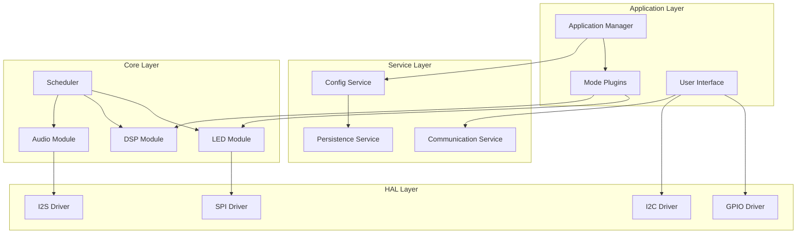

# LightwaveOS Firmware Modernization Proposal

## Vision Statement

Transform LightwaveOS from a monolithic, tightly-coupled firmware into a modular, maintainable, and extensible embedded audio-reactive platform while preserving its impressive real-time performance characteristics.

## Architectural Goals

### Primary Objectives
1. **Modularity**: Decompose monolithic code into well-defined modules
2. **Testability**: Enable comprehensive unit and integration testing
3. **Maintainability**: Reduce coupling, improve documentation, standardize patterns
4. **Extensibility**: Plugin architecture for visualization modes
5. **Reliability**: Comprehensive error handling and graceful degradation

### Performance Constraints
- Maintain 120+ FPS audio processing
- Preserve < 10ms audio-to-light latency
- Keep memory footprint < 150KB total
- Support dual-core architecture efficiently

## Proposed Modular Architecture

### High-Level Design



### Module Definitions

#### 1. Hardware Abstraction Layer (HAL)

```cpp
namespace HAL {
    // Abstract interfaces for hardware access
    class IAudioInput {
    public:
        virtual Result<AudioBuffer> capture() = 0;
        virtual Status configure(const AudioConfig& config) = 0;
    };

    class ILEDOutput {
    public:
        virtual Status write(const ColorBuffer& colors) = 0;
        virtual Status setBrightness(uint8_t level) = 0;
    };

    class IEncoderInput {
    public:
        virtual Result<EncoderState> read() = 0;
        virtual Status calibrate() = 0;
    };
}
```

#### 2. Core Modules

```cpp
namespace Core {
    // Audio Processing Module
    class AudioProcessor {
    private:
        HAL::IAudioInput* audioInput;
        CircularBuffer<AudioSample> buffer;
        AudioState state;

    public:
        Result<AudioFrame> processFrame();
        void registerCallback(AudioCallback cb);
    };

    // DSP Module
    class DSPEngine {
    private:
        GDFTProcessor gdft;
        SpectrogramGenerator spectro;
        ChromagramExtractor chroma;

    public:
        Result<FrequencyData> analyze(const AudioFrame& frame);
        void configure(const DSPConfig& config);
    };

    // LED Rendering Module
    class LEDRenderer {
    private:
        HAL::ILEDOutput* primary;
        HAL::ILEDOutput* secondary;
        RenderPipeline pipeline;

    public:
        Status render(const RenderRequest& request);
        void setMode(RenderMode mode);
    };
}
```

#### 3. Service Layer

```cpp
namespace Services {
    // Configuration Management
    class ConfigService {
    private:
        Config current;
        Config defaults;
        std::vector<ConfigObserver*> observers;

    public:
        Result<Config> load();
        Status save(const Config& config);
        void subscribe(ConfigObserver* observer);
        Status validate(const Config& config);
    };

    // Persistence Service
    class PersistenceService {
    private:
        IFileSystem* filesystem;
        Cache<std::string, ConfigData> cache;

    public:
        Result<Data> read(const Key& key);
        Status write(const Key& key, const Data& data);
        Status flush();
    };
}
```

#### 4. Application Layer

```cpp
namespace App {
    // Mode Plugin Interface
    class IVisualizationMode {
    public:
        virtual std::string getName() const = 0;
        virtual RenderData process(const AudioFeatures& features) = 0;
        virtual void configure(const ModeConfig& config) = 0;
        virtual ~IVisualizationMode() = default;
    };

    // Mode Manager
    class ModeManager {
    private:
        std::map<std::string, std::unique_ptr<IVisualizationMode>> modes;
        IVisualizationMode* activeMode;

    public:
        void registerMode(std::unique_ptr<IVisualizationMode> mode);
        Status switchMode(const std::string& name);
        RenderData processFrame(const AudioFeatures& features);
    };
}
```

### Communication Architecture

#### Event-Driven System

```cpp
// Event Bus for loose coupling
class EventBus {
public:
    template<typename EventType>
    void publish(const EventType& event);

    template<typename EventType>
    void subscribe(std::function<void(const EventType&)> handler);
};

// Event Types
struct AudioFrameReady {
    AudioFrame frame;
    timestamp_t timestamp;
};

struct ConfigChanged {
    ConfigKey key;
    ConfigValue oldValue;
    ConfigValue newValue;
};

struct ModeChangeRequest {
    std::string modeName;
    TransitionType transition;
};
```

#### Message Passing Between Cores

```cpp
// Thread-safe message queue
template<typename T>
class MessageQueue {
private:
    QueueHandle_t queue;

public:
    bool send(const T& message, TickType_t timeout = 0);
    bool receive(T& message, TickType_t timeout = portMAX_DELAY);
};

// Core communication
struct AudioToLED {
    FrequencyData spectrum;
    ChromaData chroma;
    NoveltyData novelty;
};

MessageQueue<AudioToLED> audioLedQueue;
```

## Implementation Patterns

### 1. Dependency Injection

```cpp
// Constructor injection for testability
class AudioPipeline {
private:
    std::unique_ptr<IAudioInput> input;
    std::unique_ptr<IDSPProcessor> dsp;
    std::unique_ptr<IEventPublisher> events;

public:
    AudioPipeline(
        std::unique_ptr<IAudioInput> audioInput,
        std::unique_ptr<IDSPProcessor> dspProcessor,
        std::unique_ptr<IEventPublisher> eventPublisher
    ) : input(std::move(audioInput)),
        dsp(std::move(dspProcessor)),
        events(std::move(eventPublisher)) {}
};
```

### 2. Error Handling

```cpp
// Result type for error handling
template<typename T>
class Result {
private:
    std::variant<T, Error> value;

public:
    bool isOk() const;
    bool isError() const;
    T& getValue();
    Error& getError();

    // Monadic operations
    template<typename F>
    auto map(F&& func) -> Result<decltype(func(std::declval<T>()))>;

    template<typename F>
    auto andThen(F&& func) -> decltype(func(std::declval<T>()));
};

// Usage example
Result<AudioFrame> processAudio() {
    return audioInput->capture()
        .andThen([](auto frame) { return dsp->process(frame); })
        .map([](auto processed) { return applyEffects(processed); })
        .orElse([](auto error) {
            logger->error("Audio processing failed: {}", error);
            return getDefaultFrame();
        });
}
```

### 3. State Management

```cpp
// State machine for mode transitions
class ModeStateMachine {
private:
    enum class State {
        Idle,
        Transitioning,
        Active,
        Error
    };

    State currentState = State::Idle;
    IVisualizationMode* currentMode = nullptr;
    IVisualizationMode* nextMode = nullptr;

public:
    void transitionTo(IVisualizationMode* mode) {
        switch(currentState) {
            case State::Idle:
            case State::Active:
                beginTransition(mode);
                break;
            case State::Transitioning:
                queueTransition(mode);
                break;
            case State::Error:
                recover();
                break;
        }
    }
};
```

### 4. Memory Management

```cpp
// Memory pool for real-time allocations
template<typename T, size_t N>
class MemoryPool {
private:
    alignas(T) uint8_t storage[sizeof(T) * N];
    std::array<bool, N> used{false};
    size_t nextFree = 0;

public:
    T* allocate() {
        for(size_t i = 0; i < N; ++i) {
            size_t idx = (nextFree + i) % N;
            if(!used[idx]) {
                used[idx] = true;
                nextFree = (idx + 1) % N;
                return reinterpret_cast<T*>(&storage[idx * sizeof(T)]);
            }
        }
        return nullptr;
    }

    void deallocate(T* ptr) {
        size_t idx = (reinterpret_cast<uint8_t*>(ptr) - storage) / sizeof(T);
        used[idx] = false;
    }
};
```

## Module Specifications

### Audio Module

**Responsibilities:**
- Audio capture from I2S
- Sample buffering
- DC offset correction
- Silence detection

**Interface:**
```cpp
class IAudioModule {
    virtual Result<AudioFrame> capture() = 0;
    virtual void configure(const AudioConfig& config) = 0;
    virtual AudioStats getStatistics() const = 0;
};
```

**Dependencies:**
- HAL::I2S
- Core::Buffer

### DSP Module

**Responsibilities:**
- Goertzel DFT processing
- Spectrogram generation
- Chromagram extraction
- Novelty detection

**Interface:**
```cpp
class IDSPModule {
    virtual FrequencyData processGDFT(const AudioFrame& frame) = 0;
    virtual ChromaData extractChroma(const FrequencyData& freq) = 0;
    virtual float calculateNovelty(const FrequencyData& current) = 0;
};
```

**Dependencies:**
- Core::Math
- Core::DSPAlgorithms

### LED Module

**Responsibilities:**
- Color space conversions
- Gamma correction
- Dual-strip management
- FastLED interface

**Interface:**
```cpp
class ILEDModule {
    virtual void render(const ColorBuffer& colors) = 0;
    virtual void setBrightness(uint8_t level) = 0;
    virtual void setColorCorrection(const ColorCorrection& correction) = 0;
};
```

**Dependencies:**
- HAL::SPI
- External::FastLED

### Configuration Module

**Responsibilities:**
- Configuration validation
- Preset management
- Change notifications
- Persistence coordination

**Interface:**
```cpp
class IConfigModule {
    virtual Result<Config> loadConfig() = 0;
    virtual Status saveConfig(const Config& config) = 0;
    virtual void registerObserver(IConfigObserver* observer) = 0;
    virtual Result<Config> applyPreset(const std::string& name) = 0;
};
```

## Testing Strategy

### Unit Testing Framework

```cpp
// Using Catch2 for embedded systems
TEST_CASE("GDFT processes audio correctly", "[dsp]") {
    // Arrange
    MockAudioInput mockInput;
    mockInput.setTestData(sineWave440Hz);

    GDFTProcessor processor;
    processor.configure(defaultConfig);

    // Act
    auto result = processor.process(mockInput.capture());

    // Assert
    REQUIRE(result.isOk());
    auto spectrum = result.getValue();
    REQUIRE(spectrum.getPeak() == Approx(440.0).epsilon(0.01));
}
```

### Integration Testing

```cpp
// Hardware-in-the-loop testing
TEST_CASE("Audio pipeline end-to-end", "[integration]") {
    // Setup hardware simulation
    I2SSimulator i2s;
    LEDSimulator led;

    AudioPipeline pipeline(&i2s, &led);
    pipeline.start();

    // Inject test signal
    i2s.injectSignal(testSignal);

    // Verify LED output
    std::this_thread::sleep_for(100ms);
    auto output = led.getCapturedFrames();

    REQUIRE(output.size() > 10);
    REQUIRE(verifyAudioReactivity(output));
}
```

## Migration Strategy

### Phase 1: Foundation (Weeks 1-2)
1. Create module structure and interfaces
2. Implement HAL layer with existing drivers
3. Add error handling framework
4. Set up basic unit testing

### Phase 2: Core Extraction (Weeks 3-4)
1. Extract audio processing to module
2. Extract DSP algorithms to module
3. Extract LED rendering to module
4. Maintain backwards compatibility

### Phase 3: Service Layer (Weeks 5-6)
1. Implement configuration service
2. Add persistence service
3. Create event bus
4. Migrate global state to services

### Phase 4: Application Layer (Weeks 7-8)
1. Implement mode plugin system
2. Migrate existing modes to plugins
3. Add mode manager
4. Create user interface abstraction

### Phase 5: Testing & Documentation (Weeks 9-10)
1. Complete unit test coverage
2. Add integration tests
3. Performance benchmarking
4. Documentation generation

### Phase 6: Optimization (Weeks 11-12)
1. Profile and optimize critical paths
2. Memory optimization
3. Power consumption optimization
4. Final validation

## Success Metrics

### Code Quality
- **Coupling**: Average module coupling < 5
- **Cohesion**: Module cohesion > 0.8
- **Complexity**: Cyclomatic complexity < 10
- **Coverage**: Test coverage > 80%

### Performance
- **Latency**: Audio-to-light < 10ms
- **Frame Rate**: Audio processing > 120 FPS
- **Memory**: Total usage < 150KB
- **Power**: < 500mW average

### Maintainability
- **Build Time**: < 30 seconds
- **Test Time**: < 2 minutes
- **Documentation**: 100% public API documented
- **Code Review**: < 2 hours per PR

## Risk Mitigation

### Technical Risks

1. **Performance Degradation**
   - Mitigation: Continuous benchmarking
   - Fallback: Keep optimization branches

2. **Memory Overhead**
   - Mitigation: Static allocation where possible
   - Fallback: Reduce abstraction layers

3. **Breaking Changes**
   - Mitigation: Versioned APIs
   - Fallback: Legacy compatibility layer

### Process Risks

1. **Timeline Slippage**
   - Mitigation: Agile iterations
   - Fallback: Prioritize critical modules

2. **Testing Complexity**
   - Mitigation: Incremental test coverage
   - Fallback: Focus on critical paths

## Conclusion

This modernization proposal provides a clear path from the current monolithic architecture to a modular, maintainable system while preserving the real-time performance that makes LightwaveOS unique. The phased approach minimizes risk while delivering incremental value throughout the migration process.