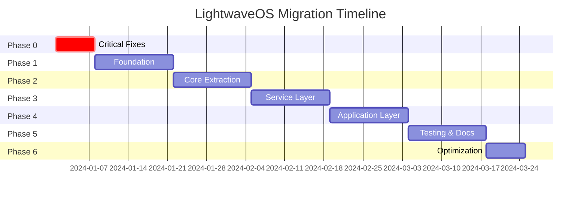

# LightwaveOS Migration Roadmap

## Executive Overview

This document outlines a comprehensive 12-week migration strategy to transform LightwaveOS from its current monolithic architecture to a modern, modular system. The migration is designed to be incremental, with each phase delivering functional improvements while maintaining system stability.

## Migration Principles

1. **Incremental Transformation**: No "big bang" rewrites
2. **Continuous Functionality**: System remains operational throughout
3. **Reversibility**: Each change can be rolled back if needed
4. **Measurable Progress**: Clear success criteria for each phase
5. **Risk Mitigation**: Test coverage increases with each phase

## Phase Overview



## Detailed Phase Breakdown

### Phase 0: Critical Fixes (Week 1) 🔥

**Goal**: Restore disabled functionality and stabilize the system

#### Tasks

1. **Restore Filesystem Functionality**
   ```cpp
   // Replace in bridge_fs.h
   void do_config_save() {
       if (!LittleFS.begin()) {
           Serial.println("LittleFS mount failed, formatting...");
           LittleFS.format();
           LittleFS.begin();
       }

       File configFile = LittleFS.open("/config.json", "w");
       if (configFile) {
           serializeConfig(configFile);
           configFile.close();
           Serial.println("Config saved successfully");
       }
   }
   ```

2. **Fix Input Systems**
   ```cpp
   // Restore in buttons.h
   void check_buttons() {
       static uint32_t lastDebounce = 0;
       if (millis() - lastDebounce < 50) return;

       uint8_t buttonState = digitalRead(BUTTON_PIN);
       if (buttonState != lastButtonState) {
           lastDebounce = millis();
           handleButtonChange(buttonState);
       }
       lastButtonState = buttonState;
   }
   ```

3. **Add Basic Error Handling**
   ```cpp
   // Add to i2s_audio.h
   bool acquire_sample_chunk() {
       size_t bytes_read = 0;
       esp_err_t result = i2s_read(
           I2S_NUM_0,
           audio_raw_state.samples_raw,
           SAMPLE_SIZE,
           &bytes_read,
           portMAX_DELAY
       );

       if (result != ESP_OK || bytes_read == 0) {
           Serial.printf("I2S read failed: %s\n", esp_err_to_name(result));
           return false;  // Caller can handle failure
       }

       process_samples(bytes_read / 2);  // 16-bit samples
       return true;
   }
   ```

4. **Memory Protection**
   ```cpp
   // Add bounds checking
   template<typename T, size_t N>
   class SafeArray {
       T data[N];
   public:
       T& operator[](size_t idx) {
           if (idx >= N) {
               Serial.printf("Array bounds violation: %zu >= %zu\n", idx, N);
               return data[N-1];  // Return last element as fallback
           }
           return data[idx];
       }
   };
   ```

#### Success Criteria
- [ ] Configuration persists across reboots
- [ ] Physical inputs (buttons/encoders) functional
- [ ] No crashes during normal operation for 1 hour
- [ ] Error messages logged for failures

#### Rollback Plan
- Git branch: `phase-0-critical-fixes`
- Keep original code in `#ifdef LEGACY_MODE` blocks
- Binary comparison testing with original

---

### Phase 1: Foundation (Weeks 2-3) 🏗️

**Goal**: Establish module structure and basic abstractions

#### Tasks

1. **Create Module Directory Structure**
   ```bash
   src/
   ├── HAL/
   │   ├── Audio/
   │   ├── LED/
   │   └── Input/
   ├── Core/
   │   ├── DSP/
   │   ├── Render/
   │   └── Scheduler/
   ├── Services/
   │   ├── Config/
   │   └── Persistence/
   └── Application/
       ├── Modes/
       └── Manager/
   ```

2. **Extract HAL Layer**
   ```cpp
   // HAL/Audio/I2SAudioDriver.h
   namespace HAL::Audio {
       class I2SAudioDriver : public IAudioDriver {
           // Move I2S code from i2s_audio.h
       };
   }
   ```

3. **Implement Error Handling Framework**
   ```cpp
   // Core/Common/Result.h
   template<typename T>
   class Result {
       // Implementation from proposal
   };
   ```

4. **Set Up Basic Unit Testing**
   ```cpp
   // test/HAL/Audio/MockAudioDriver_test.cpp
   TEST_CASE("Mock audio driver generates test signals") {
       MockAudioDriver driver;
       driver.setGenerator([]() {
           return generateSineWave(440.0f);
       });

       auto result = driver.capture();
       REQUIRE(result.isOk());
   }
   ```

#### Success Criteria
- [ ] Module structure in place
- [ ] HAL interfaces defined
- [ ] 10 unit tests passing
- [ ] Original functionality preserved

---

### Phase 2: Core Extraction (Weeks 4-5) 💎

**Goal**: Extract core processing logic into modules

#### Tasks

1. **Extract Audio Processing**
   ```cpp
   // Core/Audio/AudioProcessor.cpp
   namespace Core::Audio {
       class AudioProcessor {
           // Move from main.cpp and i2s_audio.h
       };
   }
   ```

2. **Extract DSP Algorithms**
   ```cpp
   // Core/DSP/GDFTProcessor.cpp
   namespace Core::DSP {
       class GDFTProcessor {
           // Move from GDFT.h
       };
   }
   ```

3. **Extract LED Rendering**
   ```cpp
   // Core/Render/LEDRenderer.cpp
   namespace Core::Render {
       class LEDRenderer {
           // Move from led_utilities.h
       };
   }
   ```

4. **Create Module Interfaces**
   ```cpp
   // Each module gets an interface file
   // Core/Audio/IAudioProcessor.h
   // Core/DSP/IDSPProcessor.h
   // Core/Render/ILEDRenderer.h
   ```

#### Migration Script
```python
#!/usr/bin/env python3
# tools/migrate_core.py

import os
import re

def extract_functions(source_file, pattern, target_file):
    """Extract functions matching pattern to target file"""
    with open(source_file, 'r') as f:
        content = f.read()

    matches = re.findall(pattern, content, re.MULTILINE | re.DOTALL)

    with open(target_file, 'w') as f:
        f.write(f"// Extracted from {source_file}\n\n")
        for match in matches:
            f.write(match)
            f.write("\n\n")

# Example usage
extract_functions(
    'src/GDFT.h',
    r'(void process_GDFT\([^)]*\)\s*{[^}]*})',
    'src/Core/DSP/GDFTProcessor.cpp'
)
```

#### Success Criteria
- [ ] Core modules extracted and compiling
- [ ] No global variable access from Core layer
- [ ] 30 unit tests passing
- [ ] Performance unchanged (±5%)

---

### Phase 3: Service Layer (Weeks 6-7) 🔧

**Goal**: Implement service layer for cross-cutting concerns

#### Tasks

1. **Configuration Service**
   ```cpp
   // Services/Config/ConfigService.cpp
   namespace Services::Config {
       // Implement configuration management
       // Replace global CONFIG struct
   }
   ```

2. **Event Bus Implementation**
   ```cpp
   // Services/Events/EventBus.cpp
   namespace Services::Events {
       // Implement publish-subscribe system
   }
   ```

3. **Persistence Service**
   ```cpp
   // Services/Persistence/FileSystemPersistence.cpp
   namespace Services::Persistence {
       // Wrap LittleFS operations
   }
   ```

4. **Migrate Global State**
   ```cpp
   // Before: globals.h
   float PHOTONS = 1.0;
   float CHROMA = 1.0;

   // After: ConfigService
   configService.get<float>("photons");
   configService.get<float>("chroma");
   ```

#### Global Variable Migration Table

| Global Variable | New Location | Migration Week |
|----------------|--------------|----------------|
| CONFIG | ConfigService | Week 6 |
| spectrogram[] | DSPProcessor | Week 5 |
| chromagram[] | DSPProcessor | Week 5 |
| leds_16[] | LEDRenderer | Week 5 |
| waveform[] | AudioProcessor | Week 5 |
| audio_raw_state | AudioProcessor | Week 5 |

#### Success Criteria
- [ ] All services implemented
- [ ] 50% of globals eliminated
- [ ] Event bus handling 5+ event types
- [ ] Configuration changes persist

---

### Phase 4: Application Layer (Weeks 8-9) 🎨

**Goal**: Implement mode plugin system and application management

#### Tasks

1. **Mode Plugin System**
   ```cpp
   // Application/Modes/ModeRegistry.cpp
   void registerBuiltInModes() {
       registry.registerMode<SpectrumMode>();
       registry.registerMode<ChromagramMode>();
       registry.registerMode<BloomMode>();
       registry.registerMode<KaleidoscopeMode>();
       registry.registerMode<QuantumCollapseMode>();
       registry.registerMode<SnapwaveMode>();
   }
   ```

2. **Migrate Existing Modes**
   ```cpp
   // Before: lightshow_modes.h - giant switch statement
   switch(LIGHTSHOW_MODE) {
       case LIGHT_MODE_GDFT:
           // 200 lines of code
           break;
   }

   // After: Application/Modes/SpectrumMode.cpp
   class SpectrumMode : public VisualizationMode {
       RenderFrame process(const AudioFeatures& features) override {
           // Same logic, but encapsulated
       }
   };
   ```

3. **Application Manager**
   ```cpp
   // Application/Manager/AppManager.cpp
   class AppManager {
       void run() {
           while (running) {
               auto audio = audioProcessor->capture();
               auto features = dspProcessor->process(audio);
               auto frame = modeManager->process(features);
               ledRenderer->render(frame);
           }
       }
   };
   ```

4. **Remove Switch Statements**
   ```cpp
   // Replace mode selection
   // Before:
   switch(mode) { /* cases */ }

   // After:
   modeManager->switchTo(modeName);
   ```

#### Mode Migration Checklist

- [ ] LIGHT_MODE_GDFT → SpectrumMode
- [ ] LIGHT_MODE_GDFT_CHROMAGRAM → ChromagramMode
- [ ] LIGHT_MODE_GDFT_CHROMAGRAM_DOTS → ChromagramDotsMode
- [ ] LIGHT_MODE_BLOOM → BloomMode
- [ ] LIGHT_MODE_VU_DOT → VUDotMode
- [ ] LIGHT_MODE_KALEIDOSCOPE → KaleidoscopeMode
- [ ] LIGHT_MODE_QUANTUM_COLLAPSE → QuantumCollapseMode
- [ ] LIGHT_MODE_SNAPWAVE → SnapwaveMode
- [ ] LIGHT_MODE_SNAPWAVE_DEBUG → SnapwaveDebugMode

#### Success Criteria
- [ ] All modes converted to plugins
- [ ] Mode switching without glitches
- [ ] New mode can be added without modifying core
- [ ] 75% of globals eliminated

---

### Phase 5: Testing & Documentation (Weeks 10-11) 📚

**Goal**: Comprehensive testing and documentation

#### Tasks

1. **Unit Test Coverage**
   ```yaml
   # Target coverage by module
   HAL: 90%
   Core: 85%
   Services: 80%
   Application: 75%
   ```

2. **Integration Tests**
   ```cpp
   // test/integration/AudioPipeline_test.cpp
   TEST_CASE("Audio pipeline end-to-end") {
       // Test complete audio → DSP → LED flow
   }
   ```

3. **Performance Benchmarks**
   ```cpp
   // benchmarks/performance.cpp
   BENCHMARK("GDFT Processing") {
       // Measure processing time
       // Must be < 8ms for 120 FPS
   }
   ```

4. **Documentation Generation**
   ```bash
   # Generate API documentation
   doxygen Doxyfile

   # Generate architecture diagrams
   plantuml docs/architecture.puml

   # Generate test reports
   pytest --html=report.html
   ```

#### Documentation Deliverables

- [ ] API reference (100% public APIs documented)
- [ ] Architecture guide
- [ ] Migration guide
- [ ] Developer quickstart
- [ ] Troubleshooting guide

#### Success Criteria
- [ ] 80% overall test coverage
- [ ] All benchmarks passing
- [ ] Documentation reviewed and approved
- [ ] No critical bugs in 48-hour test

---

### Phase 6: Optimization (Week 12) 🚀

**Goal**: Performance tuning and final optimizations

#### Tasks

1. **Profile and Optimize**
   ```cpp
   // Identify hotspots
   void profileCriticalPath() {
       Profiler prof("AudioPipeline");
       // Measure each stage
   }
   ```

2. **Memory Optimization**
   ```cpp
   // Convert dynamic allocations to pools
   MemoryPool<AudioFrame, 4> audioFramePool;
   MemoryPool<RenderFrame, 2> renderFramePool;
   ```

3. **Compiler Optimizations**
   ```ini
   ; platformio.ini
   build_flags =
       -O2
       -DCORE_DEBUG_LEVEL=0
       -DNDEBUG
       -flto
       -ffunction-sections
       -fdata-sections
   ```

4. **Final Cleanup**
   - Remove all debug code
   - Delete legacy code paths
   - Optimize binary size

#### Performance Targets

| Metric | Current | Target | Achieved |
|--------|---------|--------|----------|
| Audio FPS | 120+ | 120+ | [ ] |
| LED FPS | 60+ | 60+ | [ ] |
| Latency | <10ms | <10ms | [ ] |
| RAM Usage | 100KB | <120KB | [ ] |
| Flash Usage | 500KB | <600KB | [ ] |
| Power | Unknown | <500mW | [ ] |

#### Success Criteria
- [ ] All performance targets met
- [ ] Memory usage reduced by 10%
- [ ] Binary size < 600KB
- [ ] 24-hour stability test passed

---

## Migration Validation

### Acceptance Tests

#### Functional Tests
1. **Audio Capture**: Microphone input processed correctly
2. **Frequency Analysis**: GDFT produces correct spectrum
3. **LED Rendering**: All modes display correctly
4. **Configuration**: Settings persist and load
5. **User Input**: Buttons and encoders responsive

#### Performance Tests
1. **Real-time Constraint**: 120 FPS maintained
2. **Latency**: < 10ms audio-to-light
3. **Memory**: No leaks over 24 hours
4. **CPU Usage**: < 70% on both cores

#### Regression Tests
1. **Mode Transitions**: Smooth without glitches
2. **Color Accuracy**: Matches original
3. **Sensitivity**: Audio reactivity unchanged
4. **Dual Strip**: Secondary LEDs work

### Rollback Procedures

Each phase has a rollback plan:

```bash
# Phase rollback script
#!/bin/bash
PHASE=$1
git checkout phase-${PHASE}-backup
pio run --target clean
pio run --target upload
echo "Rolled back to phase ${PHASE} backup"
```

### Risk Matrix

| Risk | Probability | Impact | Mitigation |
|------|------------|--------|------------|
| Performance regression | Medium | High | Continuous benchmarking |
| Memory overflow | Low | High | Static allocation, pools |
| Breaking changes | Medium | Medium | Feature flags, versioning |
| Schedule slip | Medium | Low | Buffer time, prioritization |
| Hardware issues | Low | High | Hardware abstraction layer |

## Post-Migration Roadmap

### Month 4: Advanced Features
- Bluetooth audio support
- Web configuration interface
- OTA updates
- Multi-unit synchronization

### Month 5: Platform Expansion
- Support for ESP32-S2
- Support for ESP32-C3
- Raspberry Pi Pico port

### Month 6: Ecosystem Development
- Plugin marketplace
- Visual mode editor
- Mobile app
- Cloud integration

## Communication Plan

### Weekly Updates
- Progress against milestones
- Blockers and risks
- Performance metrics
- Test results

### Stakeholder Reviews
- Phase completion demos
- Performance comparisons
- User acceptance testing
- Go/no-go decisions

## Conclusion

This migration roadmap provides a systematic path to modernize LightwaveOS while maintaining its core functionality and performance. The incremental approach minimizes risk while delivering continuous improvements throughout the 12-week process.

Success depends on:
1. Disciplined execution of each phase
2. Comprehensive testing at each stage
3. Clear communication with stakeholders
4. Flexibility to adjust based on discoveries

The end result will be a maintainable, extensible, and professional-grade embedded system ready for future innovation.