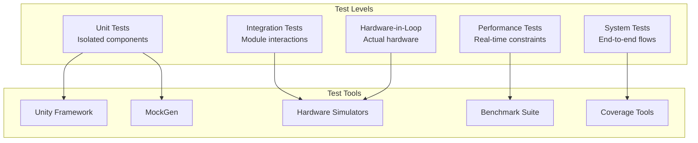

# LightwaveOS Testing Strategy

## Overview

This document outlines a comprehensive testing strategy for the LightwaveOS firmware modernization project. The strategy covers unit testing, integration testing, performance testing, and hardware-in-the-loop testing for embedded systems.

## Testing Philosophy

1. **Test-Driven Development (TDD)**: Write tests before implementation
2. **Continuous Testing**: Tests run on every commit
3. **Fast Feedback**: Unit tests complete in < 1 second
4. **Realistic Testing**: Hardware simulation where needed
5. **Measurable Coverage**: Target 80% code coverage minimum

## Testing Architecture



## Test Framework Selection

### Unity Test Framework

Selected for embedded C/C++ testing due to:
- Minimal memory footprint
- No dynamic allocation
- ESP32 compatibility
- Simple assertion macros

```cpp
// Example Unity test
#include "unity.h"
#include "Core/DSP/GDFTProcessor.h"

void setUp(void) {
    // Called before each test
}

void tearDown(void) {
    // Called after each test
}

void test_GDFTProcessor_SineWaveDetection(void) {
    // Arrange
    GDFTProcessor processor;
    int16_t sineWave[1024];
    generateSineWave(sineWave, 440.0f, 16000);

    // Act
    FrequencyData result = processor.process(sineWave, 1024);

    // Assert
    TEST_ASSERT_FLOAT_WITHIN(1.0f, 440.0f, result.getPeakFrequency());
}

int main(void) {
    UNITY_BEGIN();
    RUN_TEST(test_GDFTProcessor_SineWaveDetection);
    UNITY_END();
}
```

## Testing Categories

### 1. Unit Testing

**Goal**: Test individual functions and classes in isolation

#### Audio Module Tests

```cpp
// test/unit/HAL/Audio/I2SAudioDriver_test.cpp
class I2SAudioDriverTest : public TestFixture {
public:
    void test_InitializationSuccess() {
        // Given
        MockI2S mockI2S;
        I2SAudioDriver driver(&mockI2S);
        AudioConfig config{.sampleRate = 16000};

        // When
        auto result = driver.initialize(config);

        // Then
        TEST_ASSERT_TRUE(result.isOk());
        TEST_ASSERT_EQUAL(16000, mockI2S.getConfiguredSampleRate());
    }

    void test_CaptureReturnsValidBuffer() {
        // Given
        MockI2S mockI2S;
        mockI2S.setTestData(generateTestSignal());
        I2SAudioDriver driver(&mockI2S);

        // When
        auto result = driver.capture(100);

        // Then
        TEST_ASSERT_TRUE(result.isOk());
        TEST_ASSERT_EQUAL(128, result.getValue().size());
    }

    void test_CaptureHandlesTimeout() {
        // Given
        MockI2S mockI2S;
        mockI2S.simulateTimeout(true);
        I2SAudioDriver driver(&mockI2S);

        // When
        auto result = driver.capture(10);

        // Then
        TEST_ASSERT_FALSE(result.isOk());
        TEST_ASSERT_EQUAL("Capture timeout", result.getError().message);
    }
};
```

#### DSP Module Tests

```cpp
// test/unit/Core/DSP/GDFTProcessor_test.cpp
class GDFTProcessorTest : public TestFixture {
public:
    void test_FrequencyBinMapping() {
        // Test that frequency bins are correctly mapped
        GDFTProcessor processor;
        DSPConfig config = getDefaultDSPConfig();
        processor.configure(config);

        // Verify bin frequencies
        for (int i = 0; i < 96; i++) {
            float expectedFreq = 55.0f * pow(2, i / 12.0f);
            float actualFreq = processor.getBinFrequency(i);
            TEST_ASSERT_FLOAT_WITHIN(1.0f, expectedFreq, actualFreq);
        }
    }

    void test_SpectrogramGeneration() {
        // Test complete spectrogram generation
        GDFTProcessor processor;
        AudioBuffer buffer = generateMultiToneSignal({440, 880, 1760});

        auto result = processor.processFrame(buffer);

        TEST_ASSERT_TRUE(result.isOk());
        auto spectrum = result.getValue();

        // Verify peaks at expected frequencies
        TEST_ASSERT_TRUE(spectrum.hasPeakAt(440, 10.0f));
        TEST_ASSERT_TRUE(spectrum.hasPeakAt(880, 10.0f));
        TEST_ASSERT_TRUE(spectrum.hasPeakAt(1760, 10.0f));
    }

    void test_NoveltyDetection() {
        // Test spectral novelty calculation
        GDFTProcessor processor;

        // First frame - silence
        AudioBuffer silence = generateSilence();
        processor.processFrame(silence);

        // Second frame - sudden tone
        AudioBuffer tone = generateSineWave(1000.0f);
        auto result = processor.processFrame(tone);

        float novelty = processor.calculateNovelty(result.getValue());
        TEST_ASSERT_GREATER_THAN(0.5f, novelty);
    }
};
```

#### LED Module Tests

```cpp
// test/unit/Core/Render/LEDRenderer_test.cpp
class LEDRendererTest : public TestFixture {
    void test_ColorConversion() {
        // Test HSV to RGB conversion
        Color c = Color::fromHSV(0.0f, 1.0f, 1.0f);  // Red
        TEST_ASSERT_EQUAL_UINT8(255, c.r);
        TEST_ASSERT_EQUAL_UINT8(0, c.g);
        TEST_ASSERT_EQUAL_UINT8(0, c.b);

        c = Color::fromHSV(120.0f, 1.0f, 1.0f);  // Green
        TEST_ASSERT_EQUAL_UINT8(0, c.r);
        TEST_ASSERT_EQUAL_UINT8(255, c.g);
        TEST_ASSERT_EQUAL_UINT8(0, c.b);
    }

    void test_GammaCorrection() {
        // Test gamma correction application
        Color c{128, 128, 128};
        Color corrected = c.gammaCorrect(2.2f);

        TEST_ASSERT_EQUAL_UINT8(55, corrected.r);  // 128^(1/2.2) ≈ 55
        TEST_ASSERT_EQUAL_UINT8(55, corrected.g);
        TEST_ASSERT_EQUAL_UINT8(55, corrected.b);
    }

    void test_RenderFrameGeneration() {
        // Test render frame creation
        MockLEDDriver mockDriver;
        LEDRenderer renderer(&mockDriver);

        RenderFrame frame;
        frame.colors.resize(160);
        std::fill(frame.colors.begin(), frame.colors.end(), Color{255, 0, 0});

        auto result = renderer.render(frame);

        TEST_ASSERT_TRUE(result.isOk());
        TEST_ASSERT_EQUAL(160, mockDriver.getLastFrameSize());
    }
};
```

### 2. Integration Testing

**Goal**: Test interactions between modules

```cpp
// test/integration/AudioPipeline_test.cpp
class AudioPipelineTest : public TestFixture {
    void test_AudioToLEDPipeline() {
        // Setup
        MockAudioDriver audioDriver;
        GDFTProcessor dspProcessor;
        MockLEDDriver ledDriver;

        AudioPipeline pipeline(&audioDriver, &dspProcessor, &ledDriver);

        // Inject test signal
        audioDriver.injectSignal(generate440HzTone());

        // Run pipeline
        pipeline.processFrame();

        // Verify LED output responds to audio
        auto ledOutput = ledDriver.getCapturedFrame();
        TEST_ASSERT_NOT_NULL(ledOutput);
        TEST_ASSERT_TRUE(hasAudioResponse(ledOutput));
    }

    void test_ModeSwitch() {
        // Test mode switching during operation
        ModeManager modeManager;
        modeManager.registerMode<SpectrumMode>();
        modeManager.registerMode<ChromagramMode>();

        // Start with Spectrum mode
        modeManager.switchTo("Spectrum");
        AudioFeatures features = generateTestFeatures();
        auto frame1 = modeManager.process(features);

        // Switch to Chromagram mode
        modeManager.switchTo("Chromagram");
        auto frame2 = modeManager.process(features);

        // Verify different outputs
        TEST_ASSERT_NOT_EQUAL(frame1, frame2);
    }

    void test_ConfigurationChange() {
        // Test configuration changes propagate correctly
        ConfigService configService;
        AudioProcessor audioProcessor(&configService);

        // Change sample rate
        configService.set("audio.sampleRate", 32000);

        // Verify audio processor reconfigured
        TEST_ASSERT_EQUAL(32000, audioProcessor.getSampleRate());
    }
};
```

### 3. System Testing

**Goal**: Test complete end-to-end scenarios

```cpp
// test/system/EndToEnd_test.cpp
class EndToEndTest : public TestFixture {
    void test_CompleteBootSequence() {
        // Test system initialization
        LightwaveOS system;

        TEST_ASSERT_TRUE(system.initialize());
        TEST_ASSERT_TRUE(system.loadConfiguration());
        TEST_ASSERT_TRUE(system.startAudioCapture());
        TEST_ASSERT_TRUE(system.startLEDRendering());
    }

    void test_UserInteraction() {
        // Simulate user changing modes via encoder
        LightwaveOS system;
        system.initialize();

        // Simulate encoder rotation
        system.simulateEncoderInput(ENCODER_CW, 5);

        // Verify mode changed
        TEST_ASSERT_EQUAL("Chromagram", system.getCurrentMode());

        // Simulate button press
        system.simulateButtonPress(BUTTON_1);

        // Verify action taken
        TEST_ASSERT_TRUE(system.isNoiseCalibrationActive());
    }

    void test_ErrorRecovery() {
        // Test system recovery from errors
        LightwaveOS system;
        system.initialize();

        // Simulate I2S failure
        system.simulateHardwareFailure(HARDWARE_I2S);

        // System should recover
        waitMs(1000);
        TEST_ASSERT_TRUE(system.isOperational());
        TEST_ASSERT_TRUE(system.hasRecoveredFromError());
    }
};
```

### 4. Performance Testing

**Goal**: Verify real-time constraints are met

```cpp
// test/performance/Benchmarks.cpp
class PerformanceBenchmarks {
public:
    void benchmark_AudioCapture() {
        I2SAudioDriver driver;
        driver.initialize(defaultConfig);

        BENCHMARK("Audio Capture") {
            auto result = driver.capture(100);
            return result.getValue();
        };
        // Must complete in < 8.3ms (120 FPS)
    }

    void benchmark_GDFTProcessing() {
        GDFTProcessor processor;
        AudioBuffer buffer = generateTestAudio();

        BENCHMARK("GDFT Processing") {
            return processor.processFrame(buffer);
        };
        // Target: < 5ms
    }

    void benchmark_LEDRendering() {
        LEDRenderer renderer;
        RenderFrame frame = generateTestFrame();

        BENCHMARK("LED Rendering") {
            renderer.render(frame);
            return renderer.show();
        };
        // Target: < 2ms
    }

    void benchmark_MemoryAllocation() {
        BENCHMARK("Memory Pool Allocation") {
            MemoryPool<AudioFrame, 10> pool;
            auto* frame = pool.allocate();
            pool.deallocate(frame);
        };
        // Target: < 100μs
    }

    void benchmark_EndToEndLatency() {
        // Measure complete audio-to-LED latency
        LightwaveOS system;
        system.initialize();

        auto startTime = micros();
        system.processOneFrame();
        auto endTime = micros();

        auto latency = endTime - startTime;
        TEST_ASSERT_LESS_THAN(10000, latency);  // < 10ms
    }
};
```

### 5. Hardware-in-the-Loop Testing

**Goal**: Test with actual hardware components

```cpp
// test/hil/HardwareTests.cpp
class HardwareInLoopTests {
    void test_I2SMicrophone() {
        // Test with actual I2S microphone
        I2SAudioDriver driver;
        driver.initialize(hardwareConfig);

        // Generate test tone via speaker
        ToneGenerator generator;
        generator.playTone(1000.0f, 1000);  // 1kHz for 1 second

        // Capture and verify
        auto result = driver.capture(1000);
        TEST_ASSERT_TRUE(result.isOk());

        // Analyze captured audio
        GDFTProcessor processor;
        auto spectrum = processor.processFrame(result.getValue());
        TEST_ASSERT_TRUE(spectrum.hasPeakAt(1000.0f, 50.0f));
    }

    void test_LEDStrip() {
        // Test with actual WS2812B strip
        FastLEDRenderer renderer;
        renderer.initialize(hardwareStripConfig);

        // Test patterns
        std::vector<TestPattern> patterns = {
            RedPattern(),
            GreenPattern(),
            BluePattern(),
            RainbowPattern()
        };

        for (const auto& pattern : patterns) {
            RenderFrame frame = pattern.generate();
            renderer.render(frame);
            renderer.show();

            // Visual verification or light sensor
            TEST_ASSERT_TRUE(verifyWithLightSensor(pattern));
        }
    }

    void test_EncoderInput() {
        // Test with actual M5Rotate8 encoder
        EncoderDriver encoder;
        encoder.initialize();

        // Prompt for manual rotation
        Serial.println("Rotate encoder clockwise 5 clicks");
        waitForUserInput();

        auto state = encoder.read();
        TEST_ASSERT_EQUAL(5, state.getClickCount());
        TEST_ASSERT_EQUAL(DIRECTION_CW, state.getDirection());
    }
};
```

## Mock Objects and Simulators

### Audio Simulator

```cpp
// test/mocks/AudioSimulator.h
class AudioSimulator {
private:
    std::function<AudioBuffer()> signalGenerator;

public:
    void setSignalType(SignalType type) {
        switch(type) {
            case SINE_WAVE:
                signalGenerator = [](){ return generateSineWave(440.0f); };
                break;
            case WHITE_NOISE:
                signalGenerator = [](){ return generateWhiteNoise(); };
                break;
            case MUSIC:
                signalGenerator = [](){ return loadMusicSample("test.wav"); };
                break;
        }
    }

    AudioBuffer getNextBuffer() {
        return signalGenerator ? signalGenerator() : generateSilence();
    }
};
```

### LED Simulator

```cpp
// test/mocks/LEDSimulator.h
class LEDSimulator {
private:
    std::vector<Color> currentFrame;
    std::vector<std::vector<Color>> frameHistory;

public:
    void write(const std::vector<Color>& frame) {
        currentFrame = frame;
        frameHistory.push_back(frame);
    }

    bool verifyPattern(std::function<bool(const std::vector<Color>&)> validator) {
        return validator(currentFrame);
    }

    void saveAsImage(const std::string& filename) {
        // Convert LED data to image for visual inspection
        generateImage(currentFrame, filename);
    }
};
```

## Test Data Management

### Test Signal Generation

```cpp
// test/data/SignalGenerators.h
namespace TestSignals {
    AudioBuffer generateSineWave(float frequency, float amplitude = 1.0f) {
        AudioBuffer buffer;
        float samplesPerCycle = 16000.0f / frequency;

        for (int i = 0; i < 1024; i++) {
            float phase = (2.0f * M_PI * i) / samplesPerCycle;
            buffer[i] = static_cast<int16_t>(amplitude * 32767 * sin(phase));
        }
        return buffer;
    }

    AudioBuffer generateChirp(float startFreq, float endFreq) {
        // Frequency sweep for testing frequency response
    }

    AudioBuffer generateImpulse() {
        // Single spike for impulse response testing
    }

    AudioBuffer loadWAVFile(const std::string& path) {
        // Load real audio for realistic testing
    }
}
```

### Expected Results Database

```cpp
// test/data/ExpectedResults.h
namespace ExpectedResults {
    struct TestCase {
        std::string name;
        AudioBuffer input;
        FrequencyData expectedOutput;
        float tolerance;
    };

    std::vector<TestCase> getGDFTTestCases() {
        return {
            {"440Hz Sine", generate440Hz(), expected440HzSpectrum(), 1.0f},
            {"White Noise", generateWhiteNoise(), expectedWhiteNoiseSpectrum(), 5.0f},
            {"Music Sample", loadMusicSample(), expectedMusicSpectrum(), 10.0f}
        };
    }
}
```

## Coverage Requirements

### Module Coverage Targets

| Module | Unit Test | Integration | Total Target |
|--------|-----------|-------------|--------------|
| HAL::Audio | 90% | 80% | 85% |
| HAL::LED | 90% | 80% | 85% |
| Core::DSP | 95% | 85% | 90% |
| Core::Render | 85% | 75% | 80% |
| Services::Config | 80% | 70% | 75% |
| Application::Modes | 75% | 70% | 72% |

### Coverage Measurement

```bash
# Generate coverage report
pio test --coverage
lcov --capture --directory .pio/build --output-file coverage.info
genhtml coverage.info --output-directory coverage-report
```

## Test Automation

### Pre-commit Hooks

```bash
#!/bin/bash
# .git/hooks/pre-commit

# Run unit tests
pio test --filter "unit/*" --junit-output-path test-results.xml

if [ $? -ne 0 ]; then
    echo "Unit tests failed. Commit aborted."
    exit 1
fi

# Check coverage
coverage=$(pio test --coverage | grep "Total" | awk '{print $2}')
if [ "$coverage" -lt "80" ]; then
    echo "Coverage below 80%. Commit aborted."
    exit 1
fi
```

### Continuous Integration

```yaml
# .github/workflows/test.yml
name: Test Suite

on: [push, pull_request]

jobs:
  unit-tests:
    runs-on: ubuntu-latest
    steps:
      - uses: actions/checkout@v2
      - name: Install PlatformIO
        run: pip install platformio
      - name: Run Unit Tests
        run: pio test --filter "unit/*"

  integration-tests:
    runs-on: ubuntu-latest
    steps:
      - uses: actions/checkout@v2
      - name: Run Integration Tests
        run: pio test --filter "integration/*"

  performance-tests:
    runs-on: ubuntu-latest
    steps:
      - uses: actions/checkout@v2
      - name: Run Benchmarks
        run: pio test --filter "performance/*"
      - name: Upload Results
        uses: actions/upload-artifact@v2
        with:
          name: benchmark-results
          path: benchmark-report.json
```

## Test Reporting

### Test Report Template

```markdown
# Test Report - [Date]

## Summary
- Total Tests: 245
- Passed: 240
- Failed: 3
- Skipped: 2
- Coverage: 82.5%

## Failed Tests
1. test_GDFTProcessor_EdgeCase - Array index out of bounds
2. test_ConfigPersistence - File write failed
3. test_LEDTransition - Timing issue

## Performance Metrics
- Audio Capture: 1.2ms (avg)
- GDFT Processing: 4.8ms (avg)
- LED Rendering: 1.5ms (avg)
- End-to-End Latency: 8.1ms (avg)

## Coverage Gaps
- Services::Persistence: 65% (needs improvement)
- Error handling paths: Limited coverage

## Recommendations
1. Fix array bounds issue in GDFT
2. Add retry logic for file operations
3. Increase timing tolerance in LED tests
```

## Test Maintenance

### Test Review Checklist

- [ ] Tests are readable and well-named
- [ ] Tests follow AAA pattern (Arrange, Act, Assert)
- [ ] Mocks are properly reset between tests
- [ ] No hardcoded delays or timing dependencies
- [ ] Test data is realistic
- [ ] Edge cases are covered
- [ ] Error paths are tested
- [ ] Performance constraints verified

### Test Refactoring Guidelines

1. **DRY Principle**: Extract common setup to fixtures
2. **Single Assertion**: One logical assertion per test
3. **Independent Tests**: No order dependencies
4. **Fast Execution**: Mock expensive operations
5. **Clear Failures**: Descriptive assertion messages

## Conclusion

This comprehensive testing strategy ensures the LightwaveOS firmware maintains high quality throughout the modernization process. By combining multiple testing levels with automation and clear coverage targets, we can confidently refactor the codebase while preserving functionality and performance.